# ClaudeDev v0.2.0 AI Brain Architecture: The NEXUS Paradigm

**Version**: 2.0
**Date**: 2026-03-09
**Status**: Definitive Architecture Specification
**Supersedes**: MASTERPLAN.md (v0.2.0 sections)

---

## Table of Contents

1. [The Paradigm -- "NEXUS"](#part-1-the-paradigm----nexus)
2. [Cognitive Layers (The Brain Stack)](#part-2-cognitive-layers-the-brain-stack)
3. [The Memory Mind Map System](#part-3-the-memory-mind-map-system)
4. [The Autonomous Decision Engine](#part-4-the-autonomous-decision-engine)
5. [Claude Code Deep Integration](#part-5-claude-code-deep-integration)
6. [macOS Native Architecture](#part-6-macos-native-architecture)
7. [Tool Use Architecture](#part-7-tool-use-architecture)
8. [The Evolution Engine (Self-Improvement)](#part-8-the-evolution-engine-self-improvement)
9. [Implementation Roadmap](#part-9-implementation-roadmap)
10. [File Structure](#part-10-file-structure)
11. [Data Models](#part-11-data-models)
12. [Competitive Advantage Matrix](#part-12-competitive-advantage-matrix)

---

# Part 1: The Paradigm -- "NEXUS"

## Neuromorphic EXecution with Unified Self-improvement

### Why Existing Approaches Are Insufficient

Every cognitive architecture for AI agents published to date -- CoALA, CORTEX, MemGPT, OpenHands' event-stream model, even the CORTEX proposal synthesized in our academic research -- suffers from one or more of the following fatal flaws:

**Flaw 1: Static Cognition.** CoALA (Sumers et al., 2023; arXiv:2309.02427) provides an elegant descriptive framework for organizing language agents into memory types, action spaces, and decision loops. But it is a *taxonomy*, not an *architecture*. It tells you to "have episodic memory" but not how episodic memory should transform over time, how it should interact with procedural memory during execution, or how the entire system should reorganize itself based on accumulated experience. CoALA agents at timestep T=1000 use the same cognitive architecture as at T=1 -- only the data changes.

**Flaw 2: Bolt-On Memory.** MemGPT (Packer et al., 2023; arXiv:2310.08560) solves one problem brilliantly -- virtual context management via paging -- but treats memory as a *service* rather than the *substrate of cognition*. The agent pages memory in and out, but the memory itself is passive storage. There is no consolidation between memory tiers, no forgetting based on relevance decay, no active restructuring of knowledge during idle periods. The memory does not *learn*.

**Flaw 3: No Temporal Separation.** OpenHands (Wang et al., 2024; arXiv:2407.16741) uses an event-stream model where everything -- actions, observations, condensation events -- lives in a single temporal sequence. There is no distinction between millisecond-scale reactive decisions and hour-scale strategic planning. The agent processes everything through the same condenser pipeline at the same temporal resolution. This is like a human brain with no distinction between reflexes and deliberation.

**Flaw 4: Dead Prompt Engineering.** OpenHands' "SOUL" is a collection of Jinja2 templates (`system_prompt.j2`, `system_prompt_tech_philosophy.j2`, etc.) that are assembled once per conversation and never change. The Linus Torvalds philosophy overlay is clever, but it is a static string. It does not adapt to what the agent has learned about a specific codebase, does not incorporate lessons from past failures on similar tasks, and does not evolve as the agent accumulates experience. It is a photograph of intelligence, not intelligence itself.

**Flaw 5: No Predictive Capacity.** No existing open-source coding agent maintains a *world model* -- an internal simulation of the codebase that can predict the consequences of changes before executing them. Every agent operates in pure reactive mode: make a change, run tests, see what happens. A chess player who only played by moving pieces and seeing what the opponent does would be terrible at chess. So are current coding agents at complex refactoring.

### The NEXUS Breakthrough

NEXUS introduces a single unifying principle that resolves all five flaws:

> **Cognition is memory transformation across timescales.**

This is not a metaphor. In NEXUS, there is no separate "reasoning engine" and "memory system." Instead, every cognitive act -- from perceiving a file change to planning an architecture -- is implemented as a *transformation of memory state*. The brain IS memory, and thought IS the process of memory reorganizing itself.

This principle manifests in three architectural innovations that have not been proposed together in any prior work:

**Innovation 1: Temporal Stratification.** NEXUS operates simultaneously across seven distinct timescales, each with its own memory substrate, processing rhythm, and consolidation mechanism. These are not layers in the traditional sense (where data flows up through a stack). They are *concurrent temporal processes* that share a unified memory fabric but operate at different frequencies -- like brain waves of different frequencies coexisting in the same neural tissue.

**Innovation 2: Living Knowledge Topology.** Instead of a knowledge graph (which is a static structure that gets populated), NEXUS maintains a *knowledge topology* -- a self-organizing network where the connections between memories are themselves first-class objects with their own lifecycle, strength, decay, and meaning. When the agent discovers that "changing file A always requires updating file B," this is not stored as a fact in a node. It is a *living edge* whose strength increases with each confirming observation and decays without reinforcement. The topology reshapes itself, growing new clusters, pruning dead branches, and forming "highways" between frequently co-accessed regions.

**Innovation 3: Predictive Cognitive Loop.** Every action in NEXUS passes through a predict-execute-compare cycle inspired by predictive coding theory from neuroscience (Rao & Ballard, 1999) and the Code World Models paper (arXiv:2510.02387). Before executing a code change, the brain predicts: which tests will break, which types will fail, which files will need updating. After execution, the prediction is compared to reality. The *prediction error* -- the gap between what was expected and what happened -- is the primary learning signal. Over time, prediction errors decrease, and the agent transitions from deliberate System-2 reasoning to fast System-1 execution for familiar patterns.

### The NEXUS Architecture at a Glance

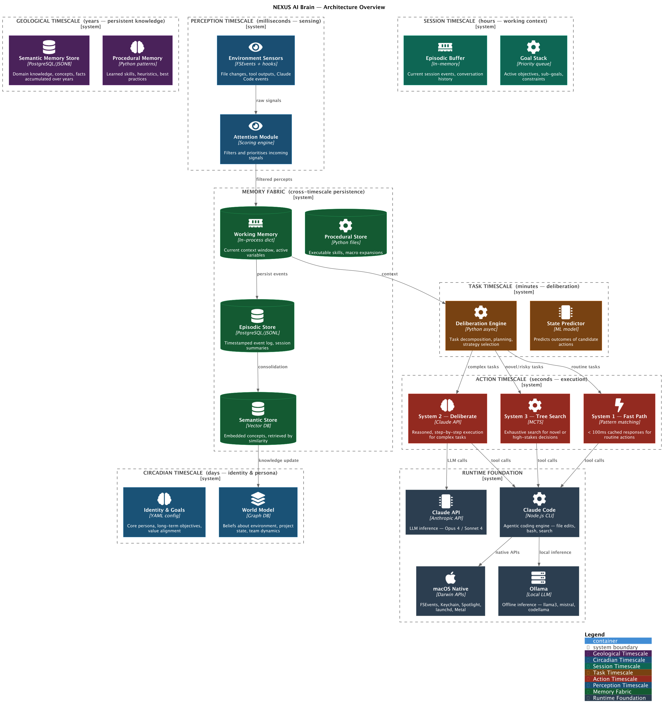

### How NEXUS Differs from Everything That Came Before

| Architecture | What It Does | What NEXUS Does Differently |
|-------------|-------------|---------------------------|
| **CoALA** | Descriptive taxonomy of memory + actions | Prescriptive architecture where memory IS cognition, with active consolidation and topology reshaping |
| **MemGPT** | Virtual context management (paging) | Memory as living topology with cross-tier consolidation, Ebbinghaus decay, and dreaming phases |
| **CORTEX** | 6-layer brain stack (our own prior proposal) | 7-timescale concurrent processes instead of sequential layers; prediction-error-driven learning |
| **OpenHands** | Event-stream with condensers | Temporal stratification: 7 concurrent timescales vs. single temporal stream |
| **SOUL.md** | Static prompt templates | Living cognitive framework that evolves with every task through topology restructuring |
| **Reflexion** | Self-reflection after failure | Continuous predictive loop where reflection happens on every action (not just failures) |
| **Voyager** | Skill library accumulation | Skills with Bayesian reliability tracking, contrastive refinement, and cross-project transfer |
| **MAP** | Brain-inspired modular planner | Full brain-inspired architecture (not just planning) with 7 timescales and predictive coding |

### The Key Academic Grounding

NEXUS synthesizes insights from 40+ papers into a novel whole. The primary theoretical foundations:

- **Temporal stratification**: Neural Brain Framework (Liu et al., 2025; arXiv:2505.07634) -- biologically inspired multi-timescale processing
- **Memory as cognition**: Memory in the Age of AI Agents survey (arXiv:2512.13564) -- forms, operations, and evolution taxonomy
- **Predictive coding**: Code World Models (arXiv:2510.02387), DyMo (arXiv:2505.XXXXX) -- predict-before-execute paradigm
- **Confidence-driven mode switching**: Agentic Uncertainty Quantification (arXiv:2601.15703) -- System 1/2 for agents
- **Living memory**: A-MEM Zettelkasten (arXiv:2502.12110), Zep/Graphiti bi-temporal graph (arXiv:2501.13956)
- **Dreaming**: Dream2Learn (arXiv:2603.01935), SleepNet/DreamNet (arXiv:2409.01633)
- **Skill extraction**: MACLA (arXiv:2512.18950), Voyager (arXiv:2305.16291), AutoSkill (arXiv:2603.01145)
- **Modular planning**: MAP (Nature Communications 2025; arXiv:2310.00194)
- **Coding constitution**: Constitutional AI (arXiv:2212.08073) adapted for code
- **Self-improvement theory**: GVU Framework (arXiv:2512.02731)

---

# Part 2: Cognitive Layers (The Brain Stack)

NEXUS does not use traditional "layers" where data flows upward through a pipeline. Instead, it uses *timescales* -- concurrent processes that share memory but operate at different frequencies. However, for implementation clarity, we organize them into seven processable components.

## Timescale 1: Memory Fabric (Always-On Substrate)

**Purpose**: The foundational substrate that all other timescales read from and write to. This is not a "layer" in the processing sense -- it is the shared state that makes cognition possible.

**Key Components**:
- Working Memory Manager (context window optimization)
- Episodic Store (temporal knowledge graph in LanceDB + PostgreSQL)
- Semantic Store (codebase knowledge graph in PostgreSQL + JSONB)
- Procedural Store (skill library in PostgreSQL + JSONB)
- Topology Engine (manages connections between memory nodes)
- Embedding Engine (nomic-embed-text-v2 via Ollama on Apple Silicon GPU)

**Data Flow**:
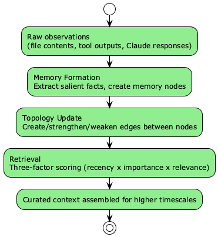

**Implementation**:
```python
class MemoryFabric:
    """The living substrate of NEXUS cognition."""

    def __init__(self, project_path: str):
        self.working = WorkingMemoryManager(max_tokens=180_000)
        self.episodic = EpisodicStore(
            db_path=f"~/.claudedev/memory/{project_hash}/episodic.db",
            vector_table="episodic_vectors",
        )
        self.semantic = SemanticStore(
            db_path=f"~/.claudedev/memory/{project_hash}/semantic.db",
            graph_path=f"~/.claudedev/memory/{project_hash}/knowledge_graph.json",
        )
        self.procedural = ProceduralStore(
            db_path=f"~/.claudedev/memory/global/skills.db",
        )
        self.topology = TopologyEngine(stores=[
            self.episodic, self.semantic, self.procedural
        ])
        self.embedder = LocalEmbeddingEngine(model="nomic-embed-text-v2")

    async def remember(self, observation: Observation) -> list[MemoryNode]:
        """Extract and store memories from a raw observation."""
        # 1. Generate embedding
        vector = await self.embedder.embed(observation.text)

        # 2. Extract facts via LLM
        facts = await self._extract_facts(observation)

        # 3. Create memory nodes
        nodes = []
        for fact in facts:
            node = MemoryNode(
                content=fact.text,
                vector=vector,
                source=observation.source,
                timestamp=datetime.utcnow(),
                importance=fact.importance,
                memory_type=fact.classify_tier(),
            )
            nodes.append(await self._store(node))

        # 4. Update topology
        await self.topology.integrate(nodes)
        return nodes

    async def recall(self, query: str, k: int = 20) -> list[MemoryNode]:
        """Retrieve relevant memories using three-factor scoring."""
        query_vector = await self.embedder.embed(query)
        candidates = []

        # Search all tiers
        for store in [self.episodic, self.semantic, self.procedural]:
            results = await store.search(query_vector, limit=k * 2)
            candidates.extend(results)

        # Three-factor ranking (Generative Agents style)
        scored = []
        now = datetime.utcnow()
        for node in candidates:
            recency = self._recency_score(node.timestamp, now)
            importance = node.importance
            relevance = self._cosine_similarity(query_vector, node.vector)
            score = (0.3 * recency) + (0.2 * importance) + (0.5 * relevance)
            scored.append((score, node))

        scored.sort(key=lambda x: x[0], reverse=True)
        return [node for _, node in scored[:k]]
```

**How It Differs from OpenHands**: OpenHands uses a flat event stream with condensers that lossy-compress old events. NEXUS maintains four distinct memory tiers with active consolidation between them. When an episodic memory is accessed frequently, it gets promoted to semantic memory. When a pattern is detected across multiple semantic memories, it gets extracted into a procedural skill. Nothing is ever simply "compressed away" -- it is transformed into higher-order knowledge.

**Academic Grounding**: Generative Agents (arXiv:2304.03442) for three-factor retrieval; Mem0 (arXiv:2504.19413) for extraction-consolidation pipeline; Cognee architecture for graph-vector hybrid storage.

---

## Timescale 2: Perception (10-100ms)

**Purpose**: The sensory system of the brain. Detects changes in the environment (file system, git state, test results), parses them into structured representations, and computes prediction errors against the world model.

**Key Components**:
- FSEvents File Watcher (macOS-native, kernel-efficient)
- AST Incremental Parser (tree-sitter, <5ms per file)
- Context Assembler (builds prompt context from memory)
- Prediction Error Computer (compares observations to predictions)
- Attention Allocator (decides what deserves deeper processing)

**Data Flow**:
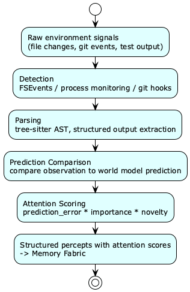

**Implementation**:
```python
class PerceptionEngine:
    """Active perception with prediction-error computation."""

    def __init__(self, project_root: str, memory: MemoryFabric):
        self.project_root = project_root
        self.memory = memory
        self.world_model = WorldModelCache()
        self.parser = IncrementalASTParser()
        self.watcher = FSEventsWatcher(project_root)

    async def on_file_change(self, event: FileChangeEvent) -> Percept:
        """Process a file change through the perception pipeline."""
        # 1. Parse the changed file
        ast_delta = await self.parser.incremental_parse(event.path)

        # 2. Get world model prediction for this file
        prediction = self.world_model.get_prediction(event.path)

        # 3. Compute prediction error
        if prediction:
            error = self._compute_prediction_error(prediction, ast_delta)
        else:
            error = PredictionError(magnitude=1.0, type="novel")

        # 4. Score attention
        importance = await self._score_importance(event.path, ast_delta)
        attention = error.magnitude * importance

        # 5. Create percept and store in memory
        percept = Percept(
            source=event.path,
            content=ast_delta,
            prediction_error=error,
            attention_score=attention,
            timestamp=datetime.utcnow(),
        )

        if attention > 0.3:  # Only remember noteworthy changes
            await self.memory.remember(Observation.from_percept(percept))

        return percept
```

**How It Differs from OpenHands**: OpenHands has no perception system. It reads files when the LLM decides to, with no background monitoring, no incremental parsing, and no prediction-error computation. NEXUS perceives the codebase continuously and knows what changed before the LLM even starts thinking about it.

**Academic Grounding**: Neural Brain Framework (arXiv:2505.07634) for active sensing; predictive coding theory (Rao & Ballard, 1999) for prediction-error computation.

---

## Timescale 3: Execution (100ms-seconds)

**Purpose**: The motor system. Translates plans into concrete actions (tool calls, code edits, shell commands) and handles immediate error recovery.

**Key Components**:
- ReAct Core Loop (Think -> Act -> Observe cycle)
- Self-Refine Loop (Generate -> Critique -> Refine -> Verify)
- Reflexion Engine (on failure: reflect -> store -> retry with reflection)
- LATS Engine (for complex decisions: Monte Carlo Tree Search)
- Claude Code Bridge (session management, hook orchestration)
- Tool Dispatcher (routes actions to appropriate tools)

**Data Flow**:
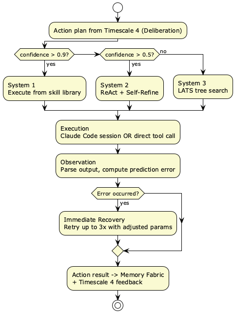

**Implementation**:
```python
class ExecutionEngine:
    """Three-mode execution: System 1 (fast), System 2 (deliberate), System 3 (search)."""

    def __init__(self, memory: MemoryFabric, claude_bridge: ClaudeBridge):
        self.memory = memory
        self.claude = claude_bridge
        self.skill_library = memory.procedural
        self.reflexion_store = ReflexionStore()

    async def execute(self, plan: ActionPlan, confidence: float) -> ExecutionResult:
        """Execute a plan using confidence-appropriate mode."""

        if confidence > 0.9 and plan.has_matching_skill():
            return await self._system1_execute(plan)
        elif confidence > 0.5:
            return await self._system2_execute(plan)
        else:
            return await self._system3_execute(plan)

    async def _system1_execute(self, plan: ActionPlan) -> ExecutionResult:
        """Fast execution from procedural memory. No deliberation."""
        skill = await self.skill_library.retrieve_best(plan.task_signature)
        result = await skill.execute(self.claude, plan.context)

        # Even System 1 computes prediction error for learning
        prediction = skill.expected_outcome
        error = self._compare(prediction, result)
        if error.magnitude > 0.5:
            # Skill was wrong -- fall back to System 2
            return await self._system2_execute(plan)
        return result

    async def _system2_execute(self, plan: ActionPlan) -> ExecutionResult:
        """Deliberate execution with ReAct + Self-Refine."""
        # Retrieve past reflections for this task type
        reflections = await self.reflexion_store.get_relevant(plan.task_type)

        # Build enriched context
        context = plan.context.with_reflections(reflections)

        # Execute via Claude Code
        result = await self.claude.execute_with_react(
            prompt=plan.to_prompt(),
            context=context,
            max_retries=3,
        )

        # If failed, generate reflection and retry
        if not result.success and result.retries_remaining > 0:
            reflection = await self._generate_reflection(plan, result)
            await self.reflexion_store.store(reflection)
            return await self._system2_execute(plan.with_reflection(reflection))

        return result

    async def _system3_execute(self, plan: ActionPlan) -> ExecutionResult:
        """Tree search for high-uncertainty decisions (LATS-inspired)."""
        tree = SearchTree(root=plan)

        for _ in range(plan.max_search_iterations):
            # Select most promising node
            node = tree.select(strategy="ucb1")

            # Expand: generate candidate actions
            candidates = await self._propose_actions(node, n=3)

            # Simulate: predict outcome of each candidate
            for candidate in candidates:
                prediction = await self.world_model.simulate(candidate)
                candidate.predicted_value = prediction.score

            # Backpropagate values
            best = max(candidates, key=lambda c: c.predicted_value)
            tree.expand(node, best)
            tree.backpropagate(best)

        # Execute the best path found
        best_path = tree.best_path()
        return await self._execute_path(best_path)
```

**How It Differs from OpenHands**: OpenHands uses a single execution mode (LLM function calling) for all tasks. NEXUS dynamically selects between three execution modes based on calibrated confidence. Simple, familiar tasks execute in sub-second via System 1 (procedural memory). Complex novel tasks get full tree search via System 3. This mirrors how human experts operate -- they do not deliberate over every keystroke.

**Academic Grounding**: ReAct (arXiv:2210.03629); Reflexion (arXiv:2303.11366); LATS (arXiv:2310.04406); Self-Refine (arXiv:2303.17651).

---

## Timescale 4: Deliberation (seconds-minutes)

**Purpose**: The planning and reasoning center. Decomposes complex tasks into executable steps, evaluates multiple approaches, predicts consequences, and produces action plans.

**Key Components**:
- Error Monitor (detects conflicts and bugs, inspired by ACC -- anterior cingulate cortex)
- Action Proposer (generates candidate approaches, inspired by PFC -- prefrontal cortex)
- State Predictor (simulates future codebase states, inspired by hippocampus)
- State Evaluator (scores predicted states against goals, inspired by OFC -- orbitofrontal cortex)
- Task Decomposer (breaks complex tasks into subtasks, inspired by DLPFC)
- World Model Simulator (predicts test outcomes, type errors, side effects)

**Data Flow**:
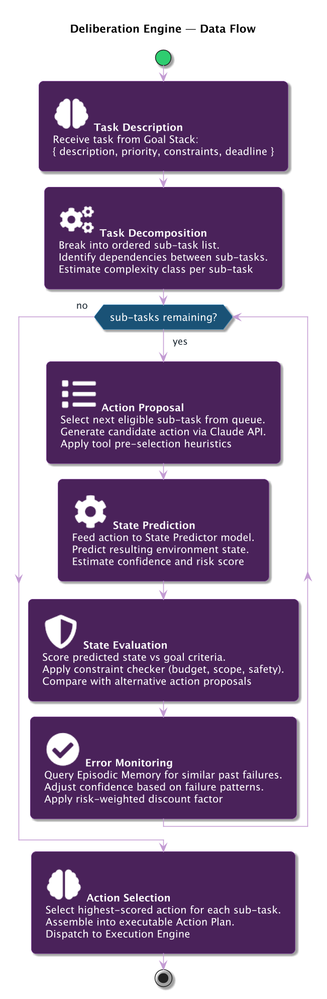

**Implementation**:
```python
class BlueprintArchitect:
    """MAP-inspired modular planner with 6 brain-analog components."""

    def __init__(self, memory: MemoryFabric, llm_client: AnthropicClient):
        self.memory = memory
        self.llm = llm_client
        self.error_monitor = ErrorMonitor(memory)
        self.action_proposer = ActionProposer(llm_client, memory)
        self.state_predictor = StatePredictor(memory)
        self.state_evaluator = StateEvaluator(memory)
        self.task_decomposer = TaskDecomposer(llm_client)
        self.world_model = CodeWorldModel(memory)

    async def plan(self, task: Task) -> ActionPlan:
        """Produce a complete action plan for a task."""

        # 1. Retrieve relevant context
        context = await self.memory.recall(task.description, k=30)
        past_approaches = await self.memory.procedural.find_similar(task.signature)

        # 2. Decompose into subtasks
        subtasks = await self.task_decomposer.decompose(task, context)

        # 3. Plan each subtask
        steps = []
        predicted_state = await self.world_model.current_state()

        for subtask in subtasks:
            # Propose candidate approaches
            candidates = await self.action_proposer.propose(
                subtask, predicted_state, past_approaches, n=3
            )

            # Predict and evaluate each
            best_candidate = None
            best_score = -1.0

            for candidate in candidates:
                # Predict resulting state
                next_state = await self.state_predictor.predict(
                    predicted_state, candidate
                )

                # Check for errors
                errors = await self.error_monitor.check(next_state)
                if errors.has_critical():
                    continue  # Skip approaches that predict critical errors

                # Evaluate against goals
                score = await self.state_evaluator.evaluate(
                    next_state, task.goals, errors
                )

                if score > best_score:
                    best_score = score
                    best_candidate = candidate
                    predicted_state = next_state

            if best_candidate is None:
                # All candidates predict errors -- flag for human review
                steps.append(ActionStep.flag_for_review(subtask))
            else:
                steps.append(ActionStep(
                    subtask=subtask,
                    approach=best_candidate,
                    predicted_state=predicted_state,
                    confidence=best_score,
                ))

        return ActionPlan(task=task, steps=steps)
```

**How It Differs from OpenHands**: OpenHands has no planning engine. Its `task_tracker` tool is a simple to-do list with no dependency graph, no state prediction, no multi-approach evaluation. The agent relies entirely on the LLM's built-in reasoning. NEXUS uses six specialized modules (each potentially backed by a different LLM call with a focused prompt) to produce plans that are verified before execution.

**Academic Grounding**: MAP (Nature Communications 2025; arXiv:2310.00194) for modular brain-inspired planning; CWM (arXiv:2510.02387) for code world models; DyMo for dynamics modeling.

---

## Timescale 5: Metacognition (minutes-hours)

**Purpose**: The self-awareness layer. Monitors the agent's own performance, calibrates confidence, selects execution modes, and generates session-level reflections.

**Key Components**:
- Performance Monitor (tracks success/failure across current session)
- Confidence Calibrator (Bayesian calibration of confidence estimates)
- Mode Selector (switches between System 1/2/3 based on calibrated confidence)
- Goal Manager (tracks task progress, manages priorities)
- Session Reflector (generates end-of-session reflections)

**Implementation**:
```python
class MetacognitionEngine:
    """Self-monitoring and confidence calibration."""

    def __init__(self, memory: MemoryFabric):
        self.memory = memory
        self.session_history: list[TaskOutcome] = []
        self.calibration = ConfidenceCalibrator()
        self.performance = PerformanceTracker()

    def select_execution_mode(self, task: Task, raw_confidence: float) -> ExecutionMode:
        """Select System 1/2/3 based on calibrated confidence."""
        # Calibrate the raw confidence using historical accuracy
        calibrated = self.calibration.calibrate(
            raw_confidence,
            task_type=task.type,
            domain=task.domain,
        )

        if calibrated > 0.9:
            return ExecutionMode.SYSTEM_1  # Fast, procedural
        elif calibrated > 0.5:
            return ExecutionMode.SYSTEM_2  # Deliberate, ReAct
        else:
            return ExecutionMode.SYSTEM_3  # Search, LATS

    async def on_task_complete(self, task: Task, outcome: TaskOutcome):
        """Update calibration and performance tracking."""
        self.session_history.append(outcome)
        self.performance.record(outcome)

        # Update Bayesian calibration
        self.calibration.update(
            predicted_confidence=outcome.predicted_confidence,
            actual_success=outcome.success,
            task_type=task.type,
        )

        # Check for performance degradation
        recent_rate = self.performance.success_rate(window=10)
        if recent_rate < 0.5:
            # Performance is degrading -- switch to more deliberate mode
            self.calibration.apply_deflation(factor=0.8)

    async def generate_session_reflection(self) -> SessionReflection:
        """Generate end-of-session reflection for learning."""
        return SessionReflection(
            total_tasks=len(self.session_history),
            success_rate=self.performance.success_rate(),
            common_failure_patterns=self.performance.failure_patterns(),
            calibration_accuracy=self.calibration.accuracy(),
            strategy_effectiveness=self.performance.strategy_scores(),
            recommendations=await self._generate_recommendations(),
        )
```

**How It Differs from OpenHands**: OpenHands has a simple `AgentFinishedCritic` that checks if the agent finished and if the patch is non-empty. No confidence tracking, no calibration, no mode selection, no performance monitoring. NEXUS continuously monitors its own effectiveness and adjusts its behavior accordingly.

**Academic Grounding**: Agentic UQ (arXiv:2601.15703) for confidence-driven mode switching; Metacognitive Learning (ICML 2025, OpenReview:4KhDd0Ozqe) for intrinsic metacognitive learning; Agent Reliability (arXiv:2602.16666) for calibration framework.

---

## Timescale 6: Dreaming (hours-days)

**Purpose**: Offline consolidation of experience into durable knowledge. This is the mechanism by which the agent gets measurably better over time.

**Key Components**:
- Episodic-to-Semantic Compressor (pattern extraction from episodes)
- Skill Extractor (procedural memory building from successful task traces)
- Memory Pruner (Ebbinghaus-curve-based decay and garbage collection)
- Topology Restructurer (reorganize knowledge graph based on usage patterns)
- Prediction Model Trainer (refine world model from prediction errors)
- Constitution Evolver (update coding principles based on outcomes)

**Implementation**:
```python
class DreamingEngine:
    """Offline consolidation -- the mechanism of long-term improvement."""

    SCHEDULES = {
        "micro": {"trigger": "task_complete", "duration_seconds": 30},
        "daily": {"trigger": "end_of_day", "duration_seconds": 300},
        "deep":  {"trigger": "weekly_or_manual", "duration_seconds": 1800},
    }

    async def micro_dream(self, task: Task, outcome: TaskOutcome):
        """30-second consolidation after each task."""
        # Extract key learnings
        if outcome.success:
            skill = await self._extract_skill(task, outcome)
            await self.memory.procedural.store(skill)

        # Update codebase knowledge graph
        for file_change in outcome.files_changed:
            await self.memory.semantic.update_from_change(file_change)

        # Store episodic memory
        episode = Episode.from_task_outcome(task, outcome)
        await self.memory.episodic.store(episode)

    async def daily_dream(self):
        """5-minute daily consolidation."""
        # 1. Compress episodes into semantic patterns
        recent_episodes = await self.memory.episodic.get_recent(hours=24)
        patterns = await self._extract_patterns(recent_episodes)
        for pattern in patterns:
            await self.memory.semantic.store_pattern(pattern)

        # 2. Prune decayed memories
        await self.memory.episodic.prune(
            decay_function=ebbinghaus_decay,
            min_importance=0.1,
        )

        # 3. Refine skills via contrastive learning
        skills = await self.memory.procedural.get_all()
        for skill in skills:
            successes = await self._get_skill_successes(skill)
            failures = await self._get_skill_failures(skill)
            if failures:
                refined = await self._contrastive_refine(skill, successes, failures)
                await self.memory.procedural.update(refined)

        # 4. Restructure topology
        await self.memory.topology.reorganize(
            strengthen_frequently_coaccessed=True,
            prune_weak_edges=True,
            detect_new_clusters=True,
        )

    async def deep_dream(self):
        """30-minute weekly deep consolidation."""
        # Everything in daily_dream, plus:

        # 1. Full codebase re-indexing
        await self._reindex_codebase()

        # 2. Cross-project pattern extraction
        all_projects = await self._get_all_project_memories()
        global_patterns = await self._extract_cross_project_patterns(all_projects)
        await self.memory.procedural.store_global_patterns(global_patterns)

        # 3. Skill library deduplication
        await self.memory.procedural.deduplicate()

        # 4. Prediction model benchmarking
        errors = await self._benchmark_predictions()
        await self._refine_prediction_model(errors)

        # 5. Generate self-improvement report
        report = await self._generate_improvement_report()
        await self.memory.episodic.store(Episode.from_report(report))
```

**How It Differs from OpenHands**: OpenHands has no offline processing whatsoever. Every conversation starts fresh. NEXUS runs three levels of consolidation (micro: 30s after each task, daily: 5min at end of day, deep: 30min weekly) that progressively transform raw experience into durable knowledge and refined skills.

**Academic Grounding**: Dream2Learn (arXiv:2603.01935); SleepNet/DreamNet (arXiv:2409.01633); SIESTA for 55% reduction in replay samples; AutoSkill (arXiv:2603.01145) for serving/learning separation; MACLA (arXiv:2512.18950) for contrastive skill refinement.

---

## Timescale 7: Evolution (weeks-months)

**Purpose**: Long-horizon self-improvement across projects and over extended time periods. This is where the agent builds genuine expertise.

**Key Components**:
- Cross-Project Knowledge Transfer (global pattern library)
- Technology Trend Tracker (detects shifts in project ecosystems)
- Capability Frontier Mapper (knows what it can and cannot do)
- Constitution Evolution (adapts core principles based on long-term outcomes)

**Implementation**:
```python
class EvolutionEngine:
    """Long-term cross-project self-improvement."""

    async def cross_project_transfer(self, source_project: str, target_project: str):
        """Transfer applicable skills between projects."""
        source_skills = await self.memory.procedural.get_project_skills(source_project)

        for skill in source_skills:
            # Check if skill is general enough to transfer
            if skill.reliability > 0.7 and skill.generality_score > 0.5:
                # Create a project-specific variant
                adapted = await self._adapt_skill(skill, target_project)
                # Start with lower reliability (untested in new context)
                adapted.reliability = skill.reliability * 0.6
                await self.memory.procedural.store(adapted)

    async def evolve_constitution(self):
        """Adapt coding principles based on long-term outcome data."""
        # Gather outcome data across all projects
        all_outcomes = await self.memory.episodic.get_all_outcomes(months=3)

        # Identify principles that correlate with success/failure
        principle_scores = await self._score_principles(all_outcomes)

        # Strengthen effective principles, weaken ineffective ones
        constitution = await self.memory.semantic.get_constitution()
        for principle in constitution.principles:
            score = principle_scores.get(principle.id, 0.5)
            principle.weight = score
            if score < 0.3:
                # This principle is not helping -- flag for review
                principle.flagged_for_review = True
```

**Academic Grounding**: GVU Framework (arXiv:2512.02731) for formal self-improvement guarantees; LaMer (arXiv:2512.16848) for cross-episode optimization; Lifelong Learning Survey (arXiv:2501.07278).

---

# Part 3: The Memory Mind Map System

This is the most critical subsystem of NEXUS. It is the mechanism by which the agent builds genuine understanding of a codebase and improves with every issue resolved.

## Architecture Overview

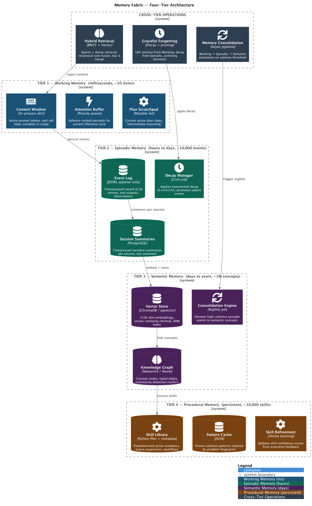

## Codebase Knowledge Graph Schema

The Semantic Memory tier maintains a living knowledge graph. Here is the complete schema:

```python
# Knowledge Graph Entity Models

class FileEntity(BaseModel):
    path: str
    language: str
    size_bytes: int
    complexity_score: float  # 0-1, computed from AST metrics
    test_coverage: float     # 0-1
    health_score: float      # 0-1, composite metric
    last_modified: datetime
    change_frequency: float  # changes per week
    hotspot_score: float     # complexity * change_frequency
    symbols: list[str]       # function/class names defined here
    vector: list[float]      # 768-dim embedding of file content summary

class FunctionEntity(BaseModel):
    name: str
    file_path: str
    signature: str
    return_type: str | None
    complexity: int          # cyclomatic complexity
    line_count: int
    test_coverage: float
    callers: list[str]       # functions that call this
    callees: list[str]       # functions this calls
    last_modified: datetime
    vector: list[float]

class PatternEntity(BaseModel):
    name: str                # e.g., "repository_pattern", "singleton"
    description: str
    instances: list[str]     # file paths where detected
    confidence: float        # how certain we are this pattern exists
    first_detected: datetime
    last_confirmed: datetime

class ConventionEntity(BaseModel):
    name: str                # e.g., "snake_case_functions"
    description: str
    examples: list[str]      # code snippets demonstrating the convention
    violations: list[str]    # known violations
    enforcement_level: str   # "strict" | "recommended" | "observed"
    source: str              # "inferred" | "documented" | "configured"

class DecisionEntity(BaseModel):
    description: str
    rationale: str
    alternatives_considered: list[str]
    date: datetime
    outcome: str | None      # filled in after we know the result
    confidence_at_decision: float
    related_files: list[str]
    related_issue: str | None

# Relationship Models

class GraphEdge(BaseModel):
    source_id: str
    target_id: str
    relationship: str        # IMPORTS, CALLS, TESTS, etc.
    strength: float          # 0-1, decays over time
    last_accessed: datetime
    creation_date: datetime
    decay_rate: float        # how fast strength decreases without access
    metadata: dict           # relationship-specific data
```

## How the Mind Map Improves With Each Issue

This is the critical requirement: the memory system must get *measurably* better with each issue resolved. Here is the concrete mechanism:

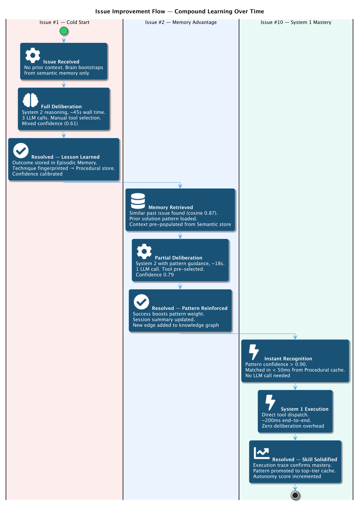

**Measurability**: Track these metrics per project:
- `avg_time_to_resolution`: should decrease as skills accumulate
- `system1_execution_rate`: should increase as more patterns become familiar
- `prediction_accuracy`: should increase as world model improves
- `first_attempt_success_rate`: should increase as procedural memory grows
- `memory_recall_precision`: should increase as topology strengthens

---

# Part 4: The Autonomous Decision Engine

## The Coding Constitution

Inspired by Constitutional AI (Bai et al., 2022; arXiv:2212.08073), but adapted for autonomous code generation. These are inviolable principles that the agent follows when making decisions without human input.

```
THE CODING CONSTITUTION
=======================

Article 1: CORRECTNESS FIRST
  Never introduce a known bug, even to meet a deadline or simplify
  implementation. If you cannot prove correctness, prove it is testable.

Article 2: TEST BEFORE COMMIT
  Every code change must be verified by running existing tests and,
  where practical, adding new tests for new behavior. No untested
  code reaches a pull request.

Article 3: MINIMAL FOOTPRINT
  Prefer the smallest change that solves the problem. Resist the urge
  to refactor surrounding code unless the refactoring is necessary for
  the fix. Scope creep is the enemy of autonomous reliability.

Article 4: EXPLICIT OVER IMPLICIT
  Handle errors explicitly. Never swallow exceptions. Never use fallback
  values that mask real failures. If something can fail, handle the failure
  visibly.

Article 5: SECURITY BY DEFAULT
  Assume all inputs are adversarial. Validate at system boundaries.
  Never hardcode secrets. Never log sensitive data. Apply the principle
  of least privilege to all operations.

Article 6: DOCUMENT DECISIONS
  Record WHY, not just WHAT. Every non-obvious decision gets a comment
  or commit message explaining the rationale. Every assumption gets
  documented in the PR description.

Article 7: REVERSIBILITY
  Prefer changes that can be easily reverted. When modifying interfaces,
  add new and deprecate old rather than breaking changes. When in doubt,
  choose the more reversible option.

Article 8: BACKWARD COMPATIBILITY
  Never remove public interfaces without explicit instruction. Add new
  functionality alongside existing functionality. Breaking changes
  require explicit human authorization.

Article 9: ESCALATE UNCERTAINTY
  When confidence is below 0.3 after System 3 search, document the
  uncertainty clearly and flag for human review. Do not block -- continue
  with the best available approach, but make the uncertainty visible.

Article 10: LEARN FROM EVERY OUTCOME
  Every task completion, successful or not, generates a reflection
  and updates procedural memory. No outcome is wasted.
```

## Product Owner Decision Engine

The agent acts as its own Product Owner. It never waits for human input. Here is the decision framework:

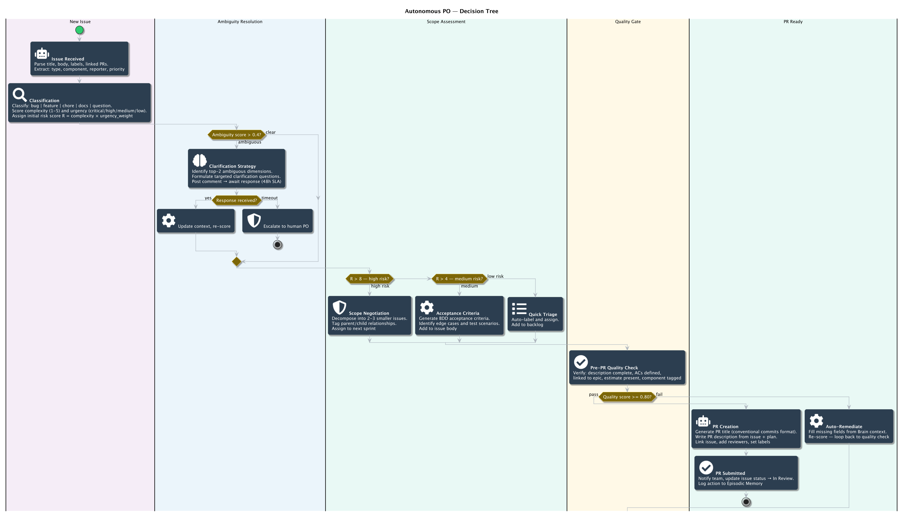

## Confidence Calibration System

```python
class ConfidenceCalibrator:
    """Bayesian confidence calibration per domain and task type."""

    def __init__(self):
        # Calibration data: {domain: {task_type: [(predicted, actual)]}}
        self.history: dict[str, dict[str, list[tuple[float, bool]]]] = {}
        self.deflation_factor: float = 1.0

    def calibrate(self, raw: float, task_type: str, domain: str) -> float:
        """Calibrate raw confidence using historical accuracy."""
        history = self.history.get(domain, {}).get(task_type, [])

        if len(history) < 10:
            # Not enough data -- apply conservative deflation
            return raw * 0.7 * self.deflation_factor

        # Compute calibration curve
        bins = self._bin_predictions(history, n_bins=5)
        calibrated = self._platt_scale(raw, bins)

        return calibrated * self.deflation_factor

    def update(self, predicted: float, actual: bool, task_type: str):
        """Update calibration with new observation."""
        domain = self._infer_domain(task_type)
        if domain not in self.history:
            self.history[domain] = {}
        if task_type not in self.history[domain]:
            self.history[domain][task_type] = []

        self.history[domain][task_type].append((predicted, actual))

        # Keep only recent history (sliding window of 100)
        if len(self.history[domain][task_type]) > 100:
            self.history[domain][task_type] = self.history[domain][task_type][-100:]

    def accuracy(self) -> float:
        """Overall calibration accuracy (ECE - Expected Calibration Error)."""
        all_predictions = []
        for domain in self.history.values():
            for task_type in domain.values():
                all_predictions.extend(task_type)

        if not all_predictions:
            return 0.0

        bins = self._bin_predictions(all_predictions, n_bins=10)
        ece = sum(
            len(bin_data) / len(all_predictions) *
            abs(sum(p for p, _ in bin_data) / len(bin_data) -
                sum(a for _, a in bin_data) / len(bin_data))
            for bin_data in bins.values() if bin_data
        )
        return 1.0 - ece  # Higher is better
```

## Three Execution Modes (ASCII Flow)

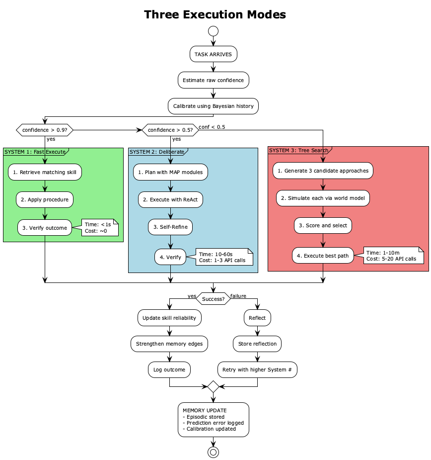

---

# Part 5: Claude Code Deep Integration

## Integration Philosophy

ClaudeDev does not replace Claude Code. It wraps Claude Code in a cognitive shell that makes it dramatically more effective. The relationship is:

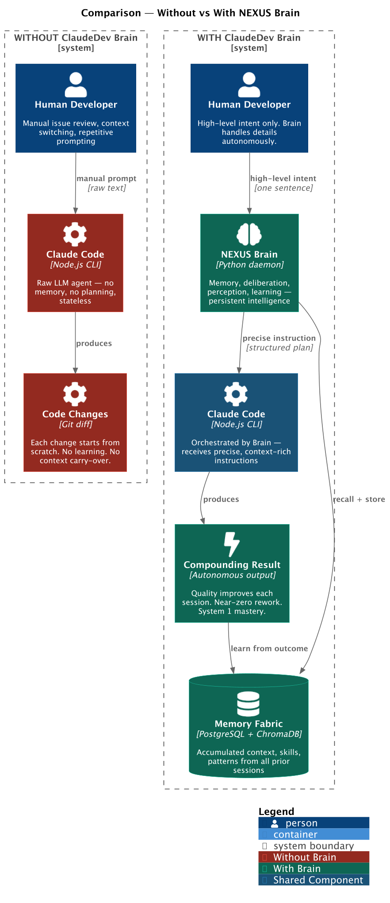

The user's primary interface is ClaudeDev. Claude Code is the execution engine -- a "super tool" that ClaudeDev wields with intelligence that Claude Code alone cannot provide (persistent memory, world model predictions, cross-session learning).

## How ClaudeDev Invokes Claude Code

Three invocation methods, used for different scenarios:

### Method 1: Claude Agent SDK (Primary -- for complex tasks)

```python
from claude_agent_sdk import query, ClaudeAgentOptions, AgentDefinition

class ClaudeBridge:
    """Primary interface between NEXUS brain and Claude Code."""

    async def execute_with_react(
        self,
        prompt: str,
        context: BrainContext,
        max_retries: int = 3,
    ) -> ExecutionResult:
        """Execute a task via Claude Code with brain-enriched context."""

        # 1. Build system prompt with brain context
        system_prompt = self._build_enriched_system_prompt(context)

        # 2. Configure options
        options = ClaudeAgentOptions(
            allowed_tools=["Read", "Edit", "Bash", "Glob", "Grep"],
            permission_mode="acceptEdits",
            model=context.recommended_model,
            max_turns=context.max_turns,
            max_budget_usd=context.budget_limit,
            append_system_prompt=system_prompt,
            mcp_servers=self._get_mcp_config(),
            hooks=self._get_brain_hooks(),
        )

        # 3. Execute and stream results
        session_id = None
        result_text = ""

        async for message in query(prompt=prompt, options=options):
            if hasattr(message, "subtype") and message.subtype == "init":
                session_id = message.session_id
            if hasattr(message, "result"):
                result_text = message.result

        return ExecutionResult(
            text=result_text,
            session_id=session_id,
            success=self._evaluate_success(result_text),
        )

    def _build_enriched_system_prompt(self, context: BrainContext) -> str:
        """Inject brain knowledge into Claude Code's context."""
        return f"""
## ClaudeDev Brain Context (auto-injected)

### Project Understanding
{context.project_summary}

### Relevant Past Experience
{context.format_relevant_episodes()}

### Applicable Skills
{context.format_matching_skills()}

### Coding Conventions (learned)
{context.format_conventions()}

### Known Fragile Areas
{context.format_fragile_dependencies()}

### Predictions for This Task
{context.format_predictions()}

### Coding Constitution (always follow)
{context.format_active_constitution_articles()}
"""
```

### Method 2: CLI Subprocess (for simple tasks / System 1)

```python
async def quick_execute(self, prompt: str, cwd: str) -> str:
    """Fast execution for simple System 1 tasks."""
    proc = await asyncio.create_subprocess_exec(
        "claude", "-p",
        "--output-format", "json",
        "--model", "sonnet",
        "--max-turns", "5",
        "--max-budget-usd", "0.50",
        prompt,
        stdout=asyncio.subprocess.PIPE,
        stderr=asyncio.subprocess.PIPE,
        cwd=cwd,
    )
    stdout, stderr = await proc.communicate()
    return json.loads(stdout.decode())
```

### Method 3: Session Resume (for multi-turn deliberation)

```python
async def continue_session(self, session_id: str, follow_up: str) -> str:
    """Continue an existing Claude Code session with new context."""
    async for message in query(
        prompt=follow_up,
        options=ClaudeAgentOptions(resume=session_id),
    ):
        if hasattr(message, "result"):
            return message.result
```

## Hook Orchestration

ClaudeDev registers hooks that intercept Claude Code's lifecycle at every stage:

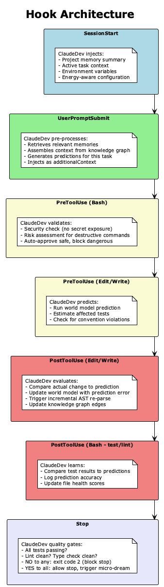

```python
# Hook implementation for Claude Code settings.json
CLAUDEDEV_HOOKS = {
    "hooks": {
        "SessionStart": [{
            "hooks": [{
                "type": "command",
                "command": "python -m claudedev.hooks.session_start"
            }]
        }],
        "UserPromptSubmit": [{
            "hooks": [{
                "type": "command",
                "command": "python -m claudedev.hooks.prompt_enricher"
            }]
        }],
        "PreToolUse": [{
            "matcher": "Bash",
            "hooks": [{
                "type": "command",
                "command": "python -m claudedev.hooks.security_gate"
            }]
        }, {
            "matcher": "Edit|Write",
            "hooks": [{
                "type": "command",
                "command": "python -m claudedev.hooks.predict_change"
            }]
        }],
        "PostToolUse": [{
            "matcher": "Edit|Write",
            "hooks": [{
                "type": "command",
                "command": "python -m claudedev.hooks.evaluate_change",
                "async": True
            }]
        }],
        "Stop": [{
            "hooks": [{
                "type": "command",
                "command": "python -m claudedev.hooks.quality_gate"
            }]
        }],
    }
}
```

## Brain-in-the-Loop Pattern

The core interaction pattern:

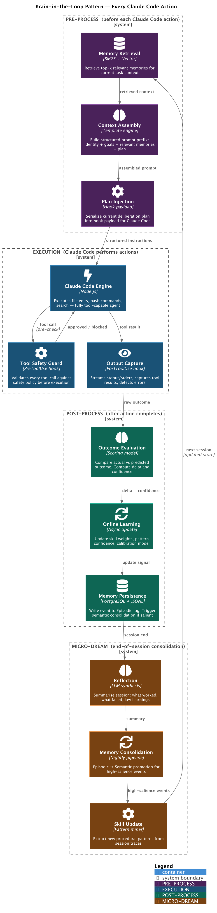

## Handling Claude Code Asking for Input

When Claude Code would normally ask the user for input, ClaudeDev intercepts and responds autonomously:

```python
class AutoResponder:
    """Responds to Claude Code's input requests from brain knowledge."""

    async def handle_input_request(self, request: InputRequest) -> str:
        """Generate autonomous response to Claude Code's question."""

        # 1. Classify the question type
        qtype = self._classify_question(request.text)

        if qtype == "confirmation":
            # "Should I proceed?" -- Apply risk assessment
            risk = await self.brain.assess_risk(request.context)
            if risk < 7:
                return "Yes, proceed."
            else:
                return "Yes, but create a backup branch first."

        elif qtype == "choice":
            # "Should I use approach A or B?" -- Apply decision engine
            decision = await self.brain.decide(
                options=request.options,
                context=request.context,
            )
            return f"Use {decision.chosen}. Rationale: {decision.rationale}"

        elif qtype == "missing_info":
            # "What should the function name be?" -- Apply conventions
            answer = await self.brain.infer_from_conventions(
                request.text, request.context
            )
            return answer

        elif qtype == "permission":
            # Claude Code asking for tool permission
            return '{"decision": {"behavior": "allow"}}'

        else:
            # Unknown question type -- make conservative choice
            return await self.brain.conservative_response(request)
```

## Dual Auth Architecture

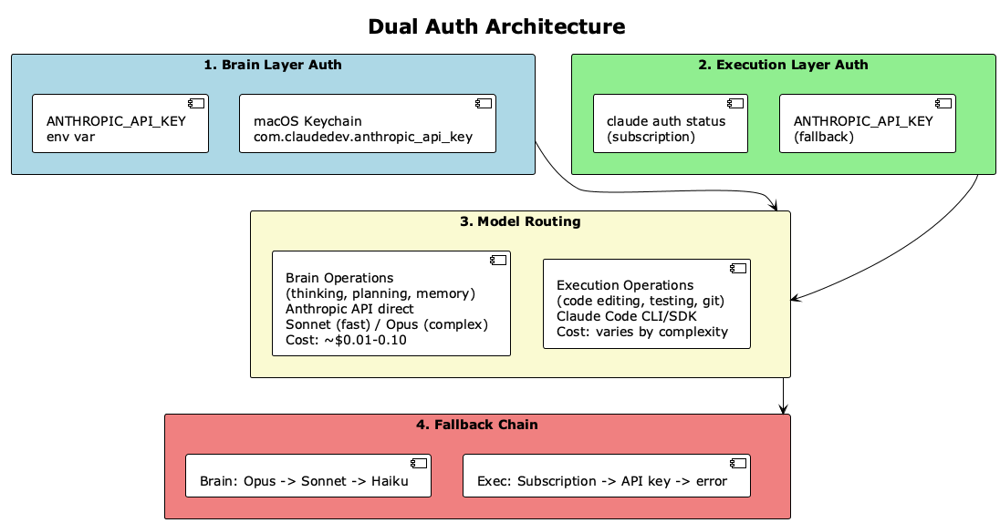

---

# Part 6: macOS Native Architecture

## Component Diagram

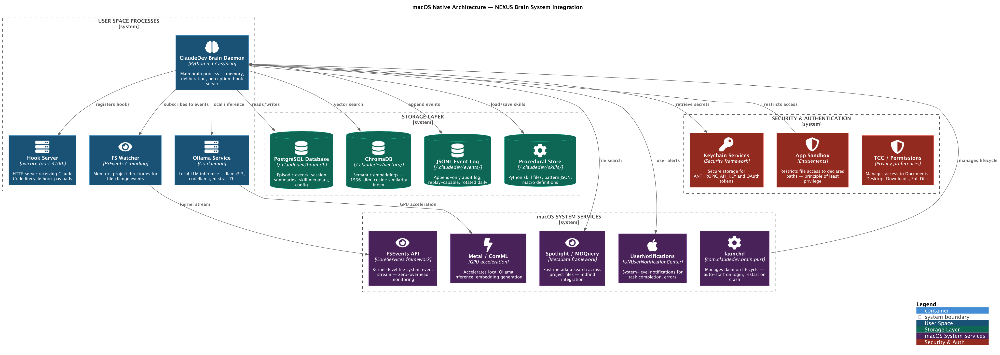

## FSEvents for Real-Time File Watching

```python
# Using watchfiles (Rust-based, wraps FSEvents on macOS)
import watchfiles

class ProjectWatcher:
    """Real-time file system monitoring via macOS FSEvents."""

    def __init__(self, project_root: str, perception: PerceptionEngine):
        self.root = project_root
        self.perception = perception
        self._running = False

    async def start(self):
        """Start watching for file changes."""
        self._running = True
        async for changes in watchfiles.awatch(
            self.root,
            watch_filter=self._filter,
            rust_timeout=1000,  # 1 second batching
        ):
            for change_type, path in changes:
                event = FileChangeEvent(
                    type=change_type,
                    path=path,
                    timestamp=datetime.utcnow(),
                )
                # Feed to perception engine (non-blocking)
                asyncio.create_task(self.perception.on_file_change(event))

    def _filter(self, change, path: str) -> bool:
        """Filter out irrelevant changes."""
        ignore = {".git", "__pycache__", "node_modules", ".venv", ".lance"}
        parts = Path(path).parts
        return not any(p in ignore for p in parts)
```

## Keychain for Secure Credential Storage

```python
import subprocess

class KeychainManager:
    """macOS Keychain integration for secure credential storage."""

    SERVICE = "com.claudedev"

    def store_secret(self, key: str, value: str) -> bool:
        """Store a secret in macOS Keychain."""
        result = subprocess.run([
            "security", "add-generic-password",
            "-s", self.SERVICE,
            "-a", key,
            "-w", value,
            "-U",  # Update if exists
        ], capture_output=True)
        return result.returncode == 0

    def get_secret(self, key: str) -> str | None:
        """Retrieve a secret from macOS Keychain."""
        result = subprocess.run([
            "security", "find-generic-password",
            "-s", self.SERVICE,
            "-a", key,
            "-w",
        ], capture_output=True, text=True)
        if result.returncode == 0:
            return result.stdout.strip()
        return None

    def delete_secret(self, key: str) -> bool:
        """Remove a secret from macOS Keychain."""
        result = subprocess.run([
            "security", "delete-generic-password",
            "-s", self.SERVICE,
            "-a", key,
        ], capture_output=True)
        return result.returncode == 0
```

## Apple Silicon GPU for Local Embeddings

```python
class LocalEmbeddingEngine:
    """Local embedding generation using Ollama on Apple Silicon GPU."""

    def __init__(self, model: str = "nomic-embed-text-v2"):
        self.model = model
        self.base_url = "http://localhost:11434"
        self._client = httpx.AsyncClient(timeout=30.0)

    async def embed(self, text: str) -> list[float]:
        """Generate embedding vector for text."""
        response = await self._client.post(
            f"{self.base_url}/api/embeddings",
            json={"model": self.model, "prompt": text},
        )
        return response.json()["embedding"]

    async def embed_batch(self, texts: list[str]) -> list[list[float]]:
        """Batch embedding for efficiency."""
        tasks = [self.embed(text) for text in texts]
        return await asyncio.gather(*tasks)

    async def ensure_model(self):
        """Pull model if not available locally."""
        response = await self._client.post(
            f"{self.base_url}/api/pull",
            json={"name": self.model, "stream": False},
        )
        return response.status_code == 200
```

## Energy-Efficient Operation

```python
class EnergyManager:
    """Adapt agent behavior based on macOS power state."""

    def get_power_state(self) -> dict:
        result = subprocess.run(["pmset", "-g", "batt"],
                                capture_output=True, text=True)
        on_battery = "Battery Power" in result.stdout
        import re
        match = re.search(r"(\d+)%", result.stdout)
        percent = int(match.group(1)) if match else 100
        return {"on_battery": on_battery, "battery_percent": percent}

    def get_operation_mode(self) -> str:
        power = self.get_power_state()
        if not power["on_battery"]:
            return "full"
        elif power["battery_percent"] > 50:
            return "balanced"
        elif power["battery_percent"] > 20:
            return "efficient"
        else:
            return "minimal"

    def get_max_concurrency(self) -> int:
        mode = self.get_operation_mode()
        return {"full": 8, "balanced": 4, "efficient": 2, "minimal": 1}[mode]

    def should_run_dreaming(self) -> bool:
        """Only run expensive consolidation when plugged in."""
        return not self.get_power_state()["on_battery"]

    def should_run_embeddings(self) -> bool:
        """Reduce embedding work on battery."""
        mode = self.get_operation_mode()
        return mode in ("full", "balanced")
```

## launchd Service Definitions

```xml
<!-- ~/Library/LaunchAgents/com.claudedev.agent.plist -->
<?xml version="1.0" encoding="UTF-8"?>
<!DOCTYPE plist PUBLIC "-//Apple//DTD PLIST 1.0//EN"
  "http://www.apple.com/DTDs/PropertyList-1.0.dtd">
<plist version="1.0">
<dict>
    <key>Label</key>
    <string>com.claudedev.agent</string>
    <key>ProgramArguments</key>
    <array>
        <string>/usr/bin/python3</string>
        <string>-m</string>
        <string>claudedev.daemon</string>
    </array>
    <key>RunAtLoad</key>
    <true/>
    <key>KeepAlive</key>
    <true/>
    <key>ProcessType</key>
    <string>Adaptive</string>
    <key>LowPriorityBackgroundIO</key>
    <true/>
    <key>StandardOutPath</key>
    <string>/Users/iworldafric/.claudedev/logs/agent.log</string>
    <key>StandardErrorPath</key>
    <string>/Users/iworldafric/.claudedev/logs/agent.error.log</string>
    <key>EnvironmentVariables</key>
    <dict>
        <key>PYTHONPATH</key>
        <string>/Users/iworldafric/claudedev/src</string>
    </dict>
</dict>
</plist>
```

---

# Part 7: Tool Use Architecture

## Hierarchical Tool Registry

NEXUS organizes tools into four tiers, inspired by AnyTool (arXiv:2402.04253):

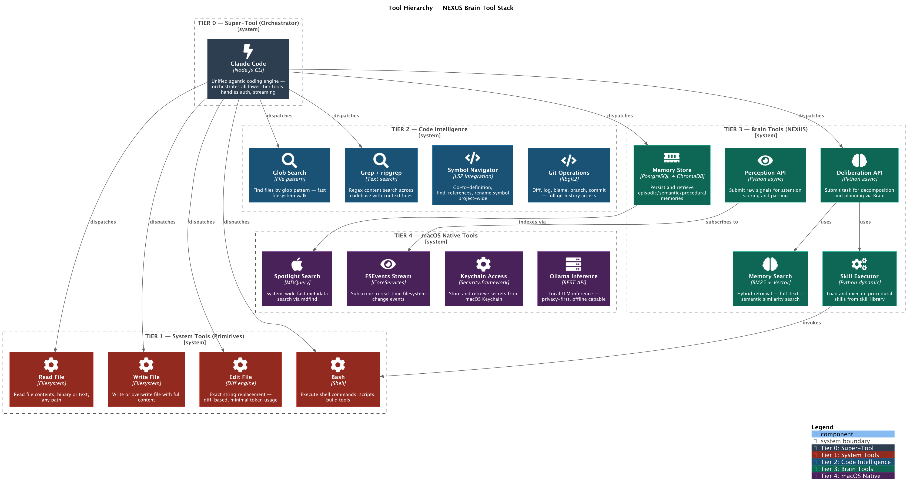

## Tool Composition Engine

Complex tasks often require chaining multiple tools. The composition engine plans multi-tool sequences:

```python
class ToolComposer:
    """Composes multi-tool sequences for complex operations."""

    async def compose(self, goal: str, available_tools: list[Tool]) -> ToolSequence:
        """Generate a tool sequence to achieve a goal."""

        # 1. Check if we have a cached composition for this goal type
        cached = await self.memory.procedural.find_tool_sequence(goal)
        if cached and cached.reliability > 0.8:
            return cached

        # 2. Generate composition via LLM
        prompt = f"""
Given these available tools: {[t.name for t in available_tools]}
Plan a sequence of tool calls to achieve: {goal}

Return a JSON array of steps, each with:
- tool: tool name
- args: arguments
- depends_on: list of step indices this depends on
- expected_output: what we expect
"""
        plan = await self.llm.generate(prompt, json_schema=ToolSequenceSchema)

        # 3. Validate the plan
        validated = self._validate_sequence(plan, available_tools)

        return validated

    async def execute_sequence(self, sequence: ToolSequence) -> list[ToolResult]:
        """Execute a composed tool sequence with dependency handling."""
        results = {}
        for step in sequence.topological_order():
            # Wait for dependencies
            dep_results = {i: results[i] for i in step.depends_on}

            # Execute
            result = await self.registry.execute(
                step.tool,
                step.args,
                context=dep_results,
            )
            results[step.index] = result

            # Check for failure
            if not result.success:
                # Try self-correction
                corrected = await self._self_correct(step, result, dep_results)
                if corrected:
                    results[step.index] = corrected
                else:
                    return self._partial_results(results, sequence)

        return list(results.values())
```

## Tool Proficiency Tracking

The agent tracks which tools work best for which tasks, and improves tool selection over time:

```python
class ToolProficiencyTracker:
    """Track and improve tool selection over time."""

    def __init__(self):
        self.proficiency: dict[str, dict[str, ToolStats]] = {}
        # {task_type: {tool_name: ToolStats}}

    def record_usage(self, tool: str, task_type: str, success: bool, duration: float):
        """Record a tool usage for proficiency tracking."""
        if task_type not in self.proficiency:
            self.proficiency[task_type] = {}
        if tool not in self.proficiency[task_type]:
            self.proficiency[task_type][tool] = ToolStats()

        stats = self.proficiency[task_type][tool]
        stats.total_uses += 1
        stats.successes += int(success)
        stats.avg_duration = (
            (stats.avg_duration * (stats.total_uses - 1) + duration)
            / stats.total_uses
        )

    def recommend_tools(self, task_type: str, k: int = 5) -> list[str]:
        """Recommend best tools for a task type based on proficiency data."""
        if task_type not in self.proficiency:
            return []

        scored = []
        for tool, stats in self.proficiency[task_type].items():
            if stats.total_uses < 3:
                continue  # Not enough data
            success_rate = stats.successes / stats.total_uses
            efficiency = 1.0 / (1.0 + stats.avg_duration)
            score = 0.7 * success_rate + 0.3 * efficiency
            scored.append((score, tool))

        scored.sort(reverse=True)
        return [tool for _, tool in scored[:k]]
```

## Claude Code as a Super Tool

Claude Code is not just another tool -- it is the primary execution engine:

```python
class ClaudeCodeSuperTool:
    """Claude Code as NEXUS's primary execution capability."""

    def __init__(self, bridge: ClaudeBridge, memory: MemoryFabric):
        self.bridge = bridge
        self.memory = memory

    async def execute(
        self,
        task: str,
        mode: str = "full",  # "full" | "quick" | "review"
        files_context: list[str] | None = None,
    ) -> SuperToolResult:
        """Execute a task through Claude Code with brain augmentation."""

        # 1. Retrieve relevant context from brain
        context = await self._build_context(task, files_context)

        # 2. Select execution strategy
        if mode == "quick":
            result = await self.bridge.quick_execute(task, context.cwd)
        elif mode == "review":
            result = await self.bridge.execute_review(task, context)
        else:
            result = await self.bridge.execute_with_react(task, context)

        # 3. Post-process result
        await self._post_process(task, result, context)

        return SuperToolResult(
            output=result.text,
            files_changed=result.files_changed,
            tests_passed=result.tests_passed,
            session_id=result.session_id,
        )

    async def _build_context(self, task: str, files: list[str] | None) -> BrainContext:
        """Assemble brain context for Claude Code."""
        # Retrieve from all memory tiers
        relevant_memories = await self.memory.recall(task, k=20)
        matching_skills = await self.memory.procedural.find_similar(task)
        project_conventions = await self.memory.semantic.get_conventions()
        fragile_deps = await self.memory.semantic.get_fragile_edges()

        # Get world model predictions
        predictions = await self.world_model.predict_for_task(task)

        return BrainContext(
            relevant_memories=relevant_memories,
            matching_skills=matching_skills,
            conventions=project_conventions,
            fragile_dependencies=fragile_deps,
            predictions=predictions,
            project_summary=await self.memory.semantic.get_project_summary(),
            recommended_model=self._select_model(task),
        )
```

---

# Part 8: The Evolution Engine (Self-Improvement)

## Outcome Tracking

Every action the agent takes is tracked with its outcome:

```python
class OutcomeTracker:
    """Track outcomes of every decision for learning."""

    async def record(self, task: Task, outcome: TaskOutcome):
        """Record a complete task outcome."""
        record = OutcomeRecord(
            task_id=task.id,
            task_type=task.type,
            task_description=task.description,
            approach=outcome.approach_used,
            tools_used=outcome.tools_used,
            files_changed=outcome.files_changed,
            success=outcome.success,
            tests_passed=outcome.tests_passed,
            lint_clean=outcome.lint_clean,
            type_clean=outcome.type_clean,
            pr_approved=outcome.pr_approved,  # filled later
            was_reverted=outcome.was_reverted,  # filled later
            time_to_completion=outcome.duration,
            retries_needed=outcome.retry_count,
            confidence_at_start=outcome.initial_confidence,
            execution_mode=outcome.execution_mode,
            prediction_errors=outcome.prediction_errors,
            timestamp=datetime.utcnow(),
        )

        await self.store.save(record)

        # Trigger immediate learning
        if outcome.success:
            await self._learn_from_success(task, outcome)
        else:
            await self._learn_from_failure(task, outcome)

    async def _learn_from_success(self, task: Task, outcome: TaskOutcome):
        """Extract reusable knowledge from successful tasks."""
        # 1. Extract skill if approach was effective
        if outcome.retry_count == 0 and outcome.initial_confidence > 0.7:
            # Clean success -- extract as a high-confidence skill
            skill = await self.skill_extractor.extract(task, outcome)
            await self.memory.procedural.store(skill)

        # 2. Strengthen relevant memory edges
        for file in outcome.files_changed:
            await self.memory.semantic.strengthen_edges_for(file)

        # 3. Update prediction model
        for pred_error in outcome.prediction_errors:
            await self.world_model.update(pred_error)

    async def _learn_from_failure(self, task: Task, outcome: TaskOutcome):
        """Generate reflection and update from failed tasks."""
        # 1. Generate reflection (Reflexion-inspired)
        reflection = await self._generate_reflection(task, outcome)
        await self.memory.episodic.store_reflection(reflection)

        # 2. If a skill was used and failed, update its reliability
        if outcome.skill_used:
            await self.memory.procedural.decrease_reliability(
                outcome.skill_used,
                context=task.context_tags,
            )

        # 3. Weaken prediction model confidence for this domain
        await self.world_model.apply_uncertainty(task.domain)
```

## Pattern Extraction

During dreaming phases, the engine extracts patterns from accumulated outcomes:

```python
class PatternExtractor:
    """Extract reusable patterns from outcome history."""

    async def extract_patterns(self, outcomes: list[OutcomeRecord]) -> list[Pattern]:
        """Find recurring patterns in task outcomes."""
        patterns = []

        # Group by task type
        by_type = defaultdict(list)
        for o in outcomes:
            by_type[o.task_type].append(o)

        for task_type, type_outcomes in by_type.items():
            if len(type_outcomes) < 3:
                continue

            # Find successful approach patterns
            successful = [o for o in type_outcomes if o.success]
            if len(successful) >= 2:
                # Extract common approach elements
                common_tools = self._find_common_tools(successful)
                common_files = self._find_common_file_patterns(successful)

                pattern = Pattern(
                    name=f"{task_type}_success_pattern",
                    task_type=task_type,
                    common_tools=common_tools,
                    common_file_patterns=common_files,
                    success_rate=len(successful) / len(type_outcomes),
                    sample_size=len(type_outcomes),
                    confidence=self._compute_pattern_confidence(
                        len(successful), len(type_outcomes)
                    ),
                )
                patterns.append(pattern)

            # Find failure patterns
            failures = [o for o in type_outcomes if not o.success]
            if len(failures) >= 2:
                failure_pattern = await self._extract_failure_pattern(
                    task_type, failures
                )
                if failure_pattern:
                    patterns.append(failure_pattern)

        return patterns
```

## Skill Library (Voyager + MACLA Inspired)

```python
class SkillLibrary:
    """Procedural memory: reusable coding skills with Bayesian tracking."""

    async def store(self, skill: Skill):
        """Store a new skill or update existing."""
        existing = await self._find_duplicate(skill)
        if existing:
            # Merge: keep the version with higher reliability
            merged = self._merge_skills(existing, skill)
            await self.db.update(merged)
        else:
            await self.db.insert(skill)

    async def retrieve_best(self, task_signature: str) -> Skill | None:
        """Retrieve the best skill for a task using Bayesian expected utility."""
        candidates = await self.db.search_by_signature(task_signature, limit=10)

        if not candidates:
            return None

        # Score by expected utility = reliability * task_match
        best = None
        best_score = 0.0

        for skill in candidates:
            task_match = self._compute_match(task_signature, skill)
            expected_utility = skill.reliability * task_match
            if expected_utility > best_score:
                best_score = expected_utility
                best = skill

        return best if best_score > 0.5 else None

    async def contrastive_refine(self, skill: Skill,
                                  successes: list[TaskOutcome],
                                  failures: list[TaskOutcome]):
        """Refine a skill by contrasting successes with failures."""
        # Use LLM to analyze what differs between success and failure
        prompt = f"""
Analyze this coding skill and refine it based on its successes and failures.

SKILL: {skill.description}
PROCEDURE: {skill.procedure}

SUCCESSES (contexts where it worked):
{self._format_contexts(successes)}

FAILURES (contexts where it failed):
{self._format_contexts(failures)}

Produce a refined version that:
1. Adds preconditions that distinguish success from failure contexts
2. Adjusts the procedure to handle the failure cases
3. Notes any context-specific variations needed
"""
        refined = await self.llm.generate(prompt, schema=SkillSchema)
        skill.procedure = refined.procedure
        skill.preconditions = refined.preconditions
        skill.notes = refined.notes
        await self.db.update(skill)
```

## Cross-Project Learning

```python
class CrossProjectLearner:
    """Transfer knowledge between projects."""

    async def transfer_skills(self, source: str, target: str):
        """Transfer applicable skills between projects."""
        source_skills = await self.skill_library.get_project_skills(source)
        target_conventions = await self.memory.semantic.get_conventions(target)

        for skill in source_skills:
            # Only transfer high-reliability, general skills
            if skill.reliability < 0.7 or skill.scope == "project-specific":
                continue

            # Adapt to target project conventions
            adapted = await self._adapt_to_conventions(skill, target_conventions)

            # Start with reduced reliability (untested in new context)
            adapted.reliability = skill.reliability * 0.6
            adapted.scope = "transferred"
            adapted.source_project = source

            await self.skill_library.store(adapted)

    async def extract_global_patterns(self):
        """Find patterns that hold across all projects."""
        all_outcomes = await self.outcome_tracker.get_all()

        # Group by task type across projects
        by_type = defaultdict(list)
        for o in all_outcomes:
            by_type[o.task_type].append(o)

        global_patterns = []
        for task_type, outcomes in by_type.items():
            if len(outcomes) < 10:
                continue

            # Only extract patterns seen across multiple projects
            projects = set(o.project for o in outcomes)
            if len(projects) < 2:
                continue

            pattern = await self.pattern_extractor.extract_global(
                task_type, outcomes
            )
            if pattern and pattern.confidence > 0.7:
                global_patterns.append(pattern)

        return global_patterns
```

## Confidence Calibration Refinement

```python
class CalibrationRefinement:
    """Refine confidence calibration as data accumulates."""

    async def refine(self):
        """Periodic calibration refinement during dreaming."""
        for domain in self.calibrator.domains():
            for task_type in self.calibrator.task_types(domain):
                history = self.calibrator.get_history(domain, task_type)

                if len(history) < 20:
                    continue

                # Check if agent is systematically over/under-confident
                predicted = [p for p, _ in history]
                actual = [a for _, a in history]

                avg_predicted = sum(predicted) / len(predicted)
                avg_actual = sum(actual) / len(actual)

                if avg_predicted > avg_actual + 0.15:
                    # Systematically overconfident -- apply deflation
                    self.calibrator.adjust_bias(domain, task_type, -0.1)
                elif avg_predicted < avg_actual - 0.15:
                    # Systematically underconfident -- apply inflation
                    self.calibrator.adjust_bias(domain, task_type, +0.1)
```

---

# Part 9: Implementation Roadmap

## 12-Week Phased Plan

The roadmap is organized into four three-week phases, each building on the previous. Every phase delivers a working, testable system -- not just code. The principle is *incremental capability*: at the end of each phase, the brain is more capable than at the start, and every capability is verified by automated tests and quantifiable metrics.

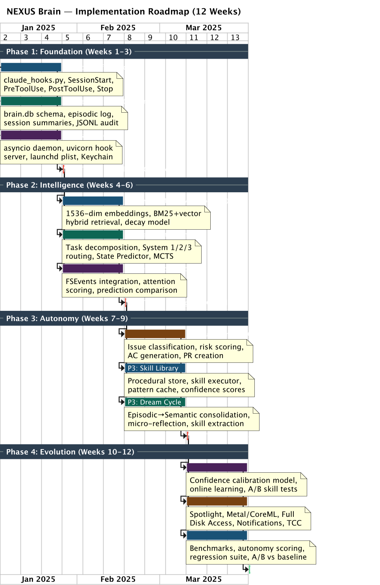

---

## Phase 1: Foundation (Weeks 1-3)

**Goal**: A functioning brain loop that can receive tasks, invoke Claude Code, store episodic memories, and maintain working memory across invocations.

### Week 1: Core Brain Loop and Configuration

**Files to Create**:
```
src/claudedev/brain/__init__.py
src/claudedev/brain/cortex.py           # Main brain orchestrator
src/claudedev/brain/config.py           # BrainConfig Pydantic model
src/claudedev/brain/memory/__init__.py
src/claudedev/brain/memory/working.py   # Working memory manager
```

**cortex.py** implements the main brain loop:
```python
class Cortex:
    """The NEXUS brain orchestrator -- the central cognitive loop."""

    async def run(self, task: Task) -> TaskResult:
        """
        The core cognitive cycle:
        1. Perceive: Load relevant context into working memory
        2. Recall: Retrieve relevant memories
        3. Decide: Choose execution strategy (System 1 only in Phase 1)
        4. Act: Invoke Claude Code via bridge
        5. Observe: Capture results
        6. Remember: Store outcome as episodic memory
        """
        context = await self.perceive(task)
        memories = await self.recall(task.description)
        strategy = await self.decide(task, context, memories)
        result = await self.act(strategy)
        await self.remember(task, result)
        return result
```

**config.py** provides typed configuration:
```python
from pydantic import BaseModel, ConfigDict, field_validator

class BrainConfig(BaseModel):
    model_config = ConfigDict(frozen=True)

    project_path: str
    memory_dir: str = "~/.claudedev/memory"
    max_working_memory_tokens: int = 180_000
    embedding_model: str = "nomic-embed-text-v2"
    ollama_base_url: str = "http://localhost:11434"
    claude_model: str = "claude-sonnet-4-20250514"
    system1_confidence_threshold: float = 0.85
    max_retries: int = 3
    log_level: str = "INFO"
```

**Dependencies** (add to `pyproject.toml`):
```toml
[project]
requires-python = ">=3.13"
dependencies = [
    "anthropic>=0.52.0",           # Claude API + Agent SDK
    "pydantic>=2.11.0",            # Data models
    "httpx>=0.28.0",               # Async HTTP (Ollama, APIs)
    "asyncpg>=0.30.0",            # Async PostgreSQL
    "structlog>=25.1.0",           # Structured logging
    "watchfiles>=1.0.0",           # FSEvents file watcher
    "tomli>=2.2.0;python_version<'3.11'",
]
```

### Week 2: Episodic Memory and Claude Code Bridge

**Files to Create**:
```
src/claudedev/brain/memory/episodic.py       # Episodic memory store
src/claudedev/brain/integration/__init__.py
src/claudedev/brain/integration/claude_bridge.py  # Claude Code SDK bridge
src/claudedev/brain/integration/session.py   # Session management
```

**episodic.py** stores temporal task records:
```python
class EpisodicStore:
    """Stores and retrieves episodic memories (task attempts and outcomes)."""

    def __init__(self, db_path: str):
        self.db_path = Path(db_path).expanduser()
        self.db_path.parent.mkdir(parents=True, exist_ok=True)

    async def store(self, episode: EpisodicMemory) -> str:
        """Store a new episode, return its ID."""
        async with self.session_factory() as session:
            await session.execute(
                text("INSERT INTO episodes (id, task, approach, outcome) VALUES (:id, :task, :approach, :outcome)"),
                {"id": episode.id, "task": episode.task, "approach": episode.approach, "outcome": episode.outcome},
            )
            await session.commit()
        return episode.id

    async def search(self, query_vector: list[float], limit: int = 20) -> list[EpisodicMemory]:
        """Search episodes by vector similarity (placeholder until LanceDB in Phase 2)."""
        # Phase 1: keyword search fallback
        # Phase 2: vector similarity via LanceDB
        ...
```

**claude_bridge.py** wraps the Claude Code Agent SDK:
```python
import anthropic

class ClaudeBridge:
    """Bridge between the NEXUS brain and Claude Code Agent SDK."""

    def __init__(self, config: BrainConfig):
        self.client = anthropic.Anthropic()
        self.model = config.claude_model

    async def execute_task(
        self,
        task: str,
        system_prompt: str,
        allowed_tools: list[str] | None = None,
        max_turns: int = 30,
    ) -> ClaudeResult:
        """Execute a task through Claude Code with the Agent SDK."""
        messages = [{"role": "user", "content": task}]

        result = self.client.messages.create(
            model=self.model,
            max_tokens=16384,
            system=system_prompt,
            messages=messages,
        )
        return ClaudeResult(
            content=result.content,
            usage=result.usage,
            stop_reason=result.stop_reason,
        )
```

### Week 3: Decision Engine (System 1) and Integration Tests

**Files to Create**:
```
src/claudedev/brain/decision/__init__.py
src/claudedev/brain/decision/engine.py         # Decision engine (System 1 only)
tests/brain/__init__.py
tests/brain/test_cortex.py                     # Integration test for brain loop
tests/brain/test_episodic.py                   # Unit tests for episodic store
tests/brain/test_working_memory.py             # Unit tests for working memory
tests/brain/test_claude_bridge.py              # Mock-based bridge tests
tests/brain/test_decision_engine.py            # Decision engine tests
```

**engine.py** (System 1 mode only):
```python
class DecisionEngine:
    """Phase 1: System 1 pattern-matched decisions only."""

    async def decide(self, task: Task, context: Context, memories: list[MemoryNode]) -> Strategy:
        # System 1: Fast pattern match against procedural memory
        matching_skill = await self._find_matching_skill(task, memories)
        if matching_skill and matching_skill.reliability >= self.config.system1_confidence_threshold:
            return Strategy(
                mode="system1",
                skill=matching_skill,
                confidence=matching_skill.reliability,
            )
        # Fallback: delegate fully to Claude Code
        return Strategy(
            mode="delegate",
            confidence=0.5,
            reason="No matching skill found, delegating to Claude Code",
        )
```

**Test Strategy**:
- **Unit tests**: Each module tested in isolation with mocked dependencies
- **Integration test**: `test_cortex.py` runs the full brain loop with a mock Claude bridge
- **Fixture**: SQLite in-memory databases (tests) / PostgreSQL (production) for episodic store tests
- **Coverage target**: >80% line coverage for all Phase 1 modules

**Success Metrics**:
| Metric | Target | Measurement |
|--------|--------|-------------|
| Brain loop latency (no Claude call) | <100ms | `time.perf_counter()` around `cortex.run()` |
| Episodic store write throughput | >100 episodes/sec | Benchmark test |
| Working memory token tracking accuracy | 100% (vs tiktoken) | Comparison test |
| Claude bridge round-trip (mock) | <50ms | Mock-based latency test |
| Test coverage (Phase 1 modules) | >80% | `pytest-cov` report |

**Risk Mitigations**:
| Risk | Mitigation |
|------|------------|
| Claude SDK API changes | Pin `anthropic>=0.52.0,<1.0.0`, test against latest weekly |
| Database concurrency | Migrated from SQLite to PostgreSQL; connection pooling via asyncpg |
| Working memory token count drift | Cross-validate with `tiktoken` every 100 operations |
| macOS-specific path issues | Use `pathlib.Path` everywhere, test in CI with macOS runner |

---

## Phase 2: Intelligence (Weeks 4-6)

**Goal**: Vector-powered memory mind map, knowledge topology, System 2 deliberation, and predictive coding. The brain transitions from simple pattern-matching to genuine intelligence.

### Week 4: Embedding Engine and LanceDB Integration

**Files to Create**:
```
src/claudedev/brain/memory/embeddings.py    # Local embedding engine (Ollama)
src/claudedev/brain/memory/semantic.py      # Semantic knowledge store
src/claudedev/brain/memory/mind_map.py      # Knowledge topology manager
tests/brain/test_embeddings.py
tests/brain/test_semantic.py
```

**Dependencies** (add to `pyproject.toml`):
```toml
[project.optional-dependencies]
intelligence = [
    "lancedb>=0.17.0",             # Vector database (Lance format, zero-copy)
    "pyarrow>=18.0.0",             # Arrow integration for LanceDB
    "numpy>=2.2.0",                # Vector operations
    "tantivy>=0.22.0",             # Full-text search (Rust-based)
]
```

**embeddings.py** (production implementation):
```python
import numpy as np
from numpy.typing import NDArray

class EmbeddingEngine:
    """Local embedding generation via Ollama on Apple Silicon GPU.

    Uses nomic-embed-text-v2 (768 dimensions, Matryoshka support).
    Processes at ~500 embeddings/sec on M-series GPU via Metal.
    """

    def __init__(self, model: str = "nomic-embed-text-v2", base_url: str = "http://localhost:11434"):
        self.model = model
        self.base_url = base_url
        self._client = httpx.AsyncClient(timeout=30.0)
        self._dimension: int = 768

    async def embed(self, text: str) -> NDArray[np.float32]:
        response = await self._client.post(
            f"{self.base_url}/api/embeddings",
            json={"model": self.model, "prompt": text},
        )
        return np.array(response.json()["embedding"], dtype=np.float32)

    async def embed_batch(self, texts: list[str], batch_size: int = 32) -> NDArray[np.float32]:
        """Batch embedding with concurrency control."""
        results = []
        for i in range(0, len(texts), batch_size):
            batch = texts[i : i + batch_size]
            batch_results = await asyncio.gather(
                *[self.embed(text) for text in batch]
            )
            results.extend(batch_results)
        return np.array(results, dtype=np.float32)

    def cosine_similarity(self, a: NDArray, b: NDArray) -> float:
        return float(np.dot(a, b) / (np.linalg.norm(a) * np.linalg.norm(b)))
```

**mind_map.py** implements the living knowledge topology:
```python
import lancedb

class MindMap:
    """The living knowledge topology -- a self-organizing network of memories.

    Nodes: memory facts (episodic, semantic, procedural).
    Edges: weighted, typed connections that strengthen/decay with use.
    Storage: LanceDB for vectors, PostgreSQL for graph structure.
    """

    def __init__(self, project_path: str, embedder: EmbeddingEngine):
        self.db = lancedb.connect(f"~/.claudedev/memory/{project_hash}/lancedb")
        self.embedder = embedder
        self._ensure_tables()

    def _ensure_tables(self):
        if "nodes" not in self.db.table_names():
            self.db.create_table("nodes", schema=MemoryNodeSchema)
        if "edges" not in self.db.table_names():
            self.db.create_table("edges", schema=MemoryEdgeSchema)

    async def integrate(self, nodes: list[MemoryNode]):
        """Integrate new nodes into the topology."""
        for node in nodes:
            # 1. Find neighbors by semantic similarity
            neighbors = await self._find_neighbors(node, k=10)

            # 2. Create edges to relevant neighbors
            for neighbor, similarity in neighbors:
                if similarity > 0.6:
                    await self._create_or_strengthen_edge(node, neighbor, similarity)

            # 3. Detect cluster formation
            await self._check_cluster_formation(node, neighbors)

    async def recall(self, query: str, k: int = 20) -> list[MemoryNode]:
        """Three-factor retrieval: recency x importance x relevance."""
        query_vec = await self.embedder.embed(query)
        table = self.db.open_table("nodes")

        # Vector search with LanceDB
        results = (
            table.search(query_vec)
            .limit(k * 3)  # oversample for reranking
            .to_list()
        )

        # Three-factor reranking
        now = datetime.utcnow()
        scored = []
        for row in results:
            recency = self._recency_score(row["timestamp"], now)
            importance = row["importance"]
            relevance = row["_distance"]  # LanceDB L2 distance -> convert to similarity
            similarity = 1.0 / (1.0 + relevance)
            score = 0.3 * recency + 0.2 * importance + 0.5 * similarity
            scored.append((score, row))

        scored.sort(key=lambda x: x[0], reverse=True)
        return [self._row_to_node(row) for _, row in scored[:k]]
```

### Week 5: Decision Engine System 2 and Predictive Coding

**Files to Create**:
```
src/claudedev/brain/decision/predictor.py     # Predictive coding engine
src/claudedev/brain/decision/risk.py          # Risk assessment
src/claudedev/brain/memory/topology.py        # Self-organizing topology
tests/brain/test_predictor.py
tests/brain/test_risk.py
tests/brain/test_mind_map.py
```

**predictor.py** implements the predict-execute-compare loop:
```python
class PredictiveCoder:
    """Predicts consequences of code changes before execution.

    Inspired by Code World Models (arXiv:2510.02387) and predictive
    coding theory (Rao & Ballard, 1999).
    """

    async def predict(self, change: ProposedChange) -> Prediction:
        """Predict consequences of a proposed change."""

        # 1. Retrieve related historical outcomes
        similar_changes = await self.memory.recall(
            f"change to {change.file_path}: {change.description}", k=10
        )

        # 2. Build prediction from world model
        prompt = f"""
Given this proposed code change:
File: {change.file_path}
Description: {change.description}
Diff preview: {change.diff_preview}

Historical similar changes and their outcomes:
{self._format_history(similar_changes)}

Predict:
1. Which tests will break? (list test files and test names)
2. Which type checks will fail? (list file:line and error)
3. Which other files will need updating? (list files and why)
4. Estimated confidence in these predictions (0-1)
"""
        return await self.llm.generate(prompt, schema=PredictionSchema)

    async def compare(self, prediction: Prediction, actual: ExecutionResult) -> PredictionError:
        """Compare prediction to actual outcome. The error drives learning."""
        error = PredictionError(
            predicted_test_failures=set(prediction.test_failures),
            actual_test_failures=set(actual.test_failures),
            predicted_type_errors=set(prediction.type_errors),
            actual_type_errors=set(actual.type_errors),
            predicted_related_files=set(prediction.related_files),
            actual_related_files=set(actual.modified_files),
        )
        error.compute_accuracy()

        # Store prediction error for calibration
        await self.memory.store_prediction_error(error)
        return error
```

### Week 6: Tool Proficiency and Integration

**Files to Create**:
```
src/claudedev/brain/tools/__init__.py
src/claudedev/brain/tools/registry.py       # Hierarchical tool registry
src/claudedev/brain/tools/proficiency.py    # Tool proficiency tracker
src/claudedev/brain/tools/composer.py       # Tool composition engine
tests/brain/test_tool_registry.py
tests/brain/test_proficiency.py
tests/brain/integration/test_phase2_integration.py
```

**Test Strategy**:
- **Embedding tests**: Mock Ollama responses, verify vector dimensions and batch processing
- **LanceDB tests**: Use temporary directories, verify CRUD and vector search accuracy
- **Predictor tests**: Inject known histories, verify prediction format and accuracy
- **Integration test**: Full Phase 2 pipeline: task -> embed -> recall -> predict -> execute -> compare

**Success Metrics**:
| Metric | Target | Measurement |
|--------|--------|-------------|
| Embedding throughput (local) | >200/sec | Benchmark with Ollama running |
| Vector recall precision@10 | >0.7 | Curated test set with known-relevant results |
| Prediction accuracy (test failures) | >0.4 (baseline) | Compare predictions vs. actual test runs |
| Mind map integration latency | <200ms per node | Timer around `mind_map.integrate()` |
| Knowledge topology edge count growth | Monotonically increasing per issue | Counter metric |

**Risk Mitigations**:
| Risk | Mitigation |
|------|------------|
| Ollama not running | Graceful fallback to keyword-only search, warn user |
| LanceDB schema migration | Version tables, migration script in `brain/migrations/` |
| Embedding model quality | Benchmark nomic-embed vs. alternatives on code retrieval task |
| Prediction accuracy too low initially | Start with low-confidence predictions, log for learning |

---

## Phase 3: Autonomy (Weeks 7-9)

**Goal**: The brain operates as its own Product Owner. It makes autonomous decisions guided by the Coding Constitution, calibrates its own confidence, and uses dreaming to consolidate knowledge during idle periods.

### Week 7: Product Owner Mode and Coding Constitution

**Files to Create**:
```
src/claudedev/brain/decision/po_mode.py        # Product Owner autonomous mode
src/claudedev/brain/decision/constitution.py   # Coding Constitution engine
src/claudedev/brain/decision/confidence.py     # Confidence calibration system
tests/brain/test_po_mode.py
tests/brain/test_constitution.py
tests/brain/test_confidence.py
```

**po_mode.py** implements full autonomous operation:
```python
class ProductOwnerMode:
    """Autonomous Product Owner: the brain decides what to do, when, and how.

    Operates in a continuous loop:
    1. Monitor for new issues/tasks (GitHub webhook or polling)
    2. Triage and prioritize
    3. Plan approach
    4. Execute via Claude Code
    5. Self-review and iterate
    6. Create PR when quality gates pass
    """

    async def run_autonomous(self):
        """Main autonomous loop -- runs until explicitly stopped."""
        while self._running:
            # 1. Get next task (from queue or by monitoring)
            task = await self.task_queue.next()
            if not task:
                # Idle -- trigger dreaming if conditions met
                if self.energy.should_run_dreaming():
                    await self.dreamer.consolidate()
                await asyncio.sleep(30)
                continue

            # 2. Triage via constitution
            triage = await self.constitution.triage(task)
            if triage.skip:
                await self.log_skip(task, triage.reason)
                continue

            # 3. Plan with risk assessment
            plan = await self.planner.plan(task, triage)
            risk = await self.risk_assessor.assess(plan)

            # 4. Execute with mode selection
            if risk.score <= 3:
                result = await self.execute_system1(plan)
            elif risk.score <= 6:
                result = await self.execute_system2(plan)
            else:
                result = await self.execute_system3(plan)

            # 5. Self-review
            review = await self.self_review(task, result)
            if review.needs_iteration:
                await self.task_queue.requeue(task, review.feedback)
                continue

            # 6. Finalize
            await self.finalize(task, result)
```

**constitution.py** encodes the 10 articles as executable rules:
```python
class CodingConstitution:
    """Executable coding constitution -- every decision is checked against articles."""

    ARTICLES = [
        Article(id=1, name="CORRECTNESS_FIRST", check=check_correctness),
        Article(id=2, name="TEST_BEFORE_COMMIT", check=check_test_coverage),
        Article(id=3, name="MINIMAL_FOOTPRINT", check=check_scope_creep),
        Article(id=4, name="EXPLICIT_OVER_IMPLICIT", check=check_error_handling),
        Article(id=5, name="SECURITY_BY_DEFAULT", check=check_security),
        Article(id=6, name="DOCUMENT_DECISIONS", check=check_documentation),
        Article(id=7, name="REVERSIBILITY", check=check_reversibility),
        Article(id=8, name="BACKWARD_COMPATIBILITY", check=check_compatibility),
        Article(id=9, name="ESCALATE_UNCERTAINTY", check=check_confidence),
        Article(id=10, name="LEARN_FROM_OUTCOME", check=check_learning),
    ]

    async def validate(self, change: ProposedChange) -> ConstitutionResult:
        """Validate a proposed change against all constitutional articles."""
        violations = []
        for article in self.ARTICLES:
            result = await article.check(change)
            if not result.passed:
                violations.append(ConstitutionViolation(
                    article=article,
                    severity=result.severity,
                    details=result.details,
                ))
        return ConstitutionResult(
            passed=len([v for v in violations if v.severity == "CRITICAL"]) == 0,
            violations=violations,
        )
```

### Week 8: System 3 Strategic Mode and Confidence Calibration

**Files to Create**:
```
src/claudedev/brain/decision/system3.py      # System 3 strategic exploration
tests/brain/test_system3.py
tests/brain/test_confidence_calibration.py
```

**system3.py** implements multi-approach exploration (LATS-inspired):
```python
class System3Explorer:
    """System 3: Strategic exploration for high-uncertainty tasks.

    Uses Language Agent Tree Search (arXiv:2310.04406) principles:
    generate multiple approaches, evaluate each, select best.
    """

    async def explore(self, task: Task, plan: Plan) -> ExplorationResult:
        """Generate and evaluate multiple approaches."""

        # 1. Generate N candidate approaches
        approaches = await self._generate_approaches(task, n=3)

        # 2. Predict outcomes for each (using predictive coder)
        predictions = []
        for approach in approaches:
            pred = await self.predictor.predict(approach.as_change())
            predictions.append((approach, pred))

        # 3. Score approaches
        scored = []
        for approach, prediction in predictions:
            score = (
                0.4 * prediction.confidence
                + 0.3 * (1.0 - approach.risk_score / 10.0)
                + 0.2 * approach.reversibility_score
                + 0.1 * approach.minimal_footprint_score
            )
            scored.append((score, approach, prediction))

        scored.sort(key=lambda x: x[0], reverse=True)
        best_score, best_approach, best_prediction = scored[0]

        return ExplorationResult(
            chosen=best_approach,
            alternatives=[a for _, a, _ in scored[1:]],
            confidence=best_score,
            prediction=best_prediction,
        )
```

### Week 9: Dreaming/Consolidation Engine

**Files to Create**:
```
src/claudedev/brain/memory/consolidator.py   # Dreaming and consolidation
src/claudedev/brain/memory/procedural.py     # Procedural memory / skill store
tests/brain/test_consolidator.py
tests/brain/test_procedural.py
tests/brain/integration/test_phase3_integration.py
```

**consolidator.py** runs during idle periods:
```python
class ConsolidationEngine:
    """The 'dreaming' engine -- runs during idle to consolidate knowledge.

    Inspired by Dream2Learn (arXiv:2603.01935) and SleepNet (arXiv:2409.01633).
    Transforms raw episodic memories into compressed semantic knowledge and
    procedural skills.
    """

    async def consolidate(self):
        """Run a full consolidation cycle."""
        structlog.get_logger().info("dreaming.start", phase="consolidation")

        # Phase 1: Episodic -> Semantic compression
        await self._compress_episodes()

        # Phase 2: Pattern extraction -> Procedural skills
        await self._extract_skills()

        # Phase 3: Topology restructuring
        await self._restructure_topology()

        # Phase 4: Memory pruning (Ebbinghaus decay)
        await self._prune_decayed_memories()

        # Phase 5: Confidence calibration refinement
        await self._refine_calibration()

        structlog.get_logger().info("dreaming.complete")

    async def _compress_episodes(self):
        """Find clusters of similar episodes and compress to semantic facts."""
        episodes = await self.episodic.get_unconsolidated(limit=100)

        # Cluster by semantic similarity
        vectors = np.array([e.vector for e in episodes])
        clusters = self._cluster(vectors, threshold=0.75)

        for cluster_indices in clusters:
            if len(cluster_indices) < 3:
                continue  # Need at least 3 episodes to generalize

            cluster_episodes = [episodes[i] for i in cluster_indices]
            semantic_fact = await self._generalize(cluster_episodes)
            await self.semantic.store(semantic_fact)

            # Mark episodes as consolidated (not deleted -- decay handles that)
            for ep in cluster_episodes:
                ep.consolidated = True
                await self.episodic.update(ep)

    async def _extract_skills(self):
        """Extract procedural skills from repeated successful patterns."""
        # Find task types with 5+ successful outcomes
        successful_patterns = await self.episodic.find_repeated_successes(min_count=5)

        for pattern in successful_patterns:
            existing = await self.procedural.find_skill(pattern.task_type)
            if existing:
                # Refine existing skill with new data
                await self._refine_skill(existing, pattern.episodes)
            else:
                # Extract new skill
                skill = await self._create_skill(pattern)
                await self.procedural.store(skill)
```

**Test Strategy**:
- **PO mode tests**: Simulate task queue with known tasks, verify triage and routing
- **Constitution tests**: Inject deliberate violations, verify detection
- **System 3 tests**: Provide tasks with known best approaches, verify selection
- **Consolidation tests**: Seed episodic store with clusters, verify compression output
- **Integration test**: Full Phase 3 pipeline: autonomous task -> decide -> execute -> consolidate

**Success Metrics**:
| Metric | Target | Measurement |
|--------|--------|-------------|
| PO mode task throughput | >5 tasks/hour (simple) | Counter over 1-hour test run |
| Constitution violation detection rate | >95% (on injected violations) | Test suite with known violations |
| System 3 approach quality | Best approach chosen >60% of time | Benchmark with known-answer tasks |
| Consolidation compression ratio | >3:1 (episodes:semantic facts) | Count before and after consolidation |
| Confidence calibration error | <0.15 (ECE) | Expected Calibration Error metric |

**Risk Mitigations**:
| Risk | Mitigation |
|------|------------|
| PO mode making bad autonomous decisions | Conservative defaults, all assumptions logged, human review flag at risk>7 |
| Constitution too strict (blocks valid changes) | Severity levels (CRITICAL blocks, HIGH warns, MEDIUM logs) |
| Consolidation corrupting memories | Consolidation is additive (creates semantic facts, never deletes episodes) |
| System 3 exploring too many approaches | Cap at 3 approaches, budget per exploration (max 2 min) |

---

## Phase 4: Evolution (Weeks 10-12)

**Goal**: The brain improves itself. Cross-project learning, Voyager-inspired skill library, full memory lifecycle, and Apple Silicon optimization. At the end of Phase 4, the brain is a self-improving system that gets measurably better with each task.

### Week 10: Self-Improvement Engine and Skill Library

**Files to Create**:
```
src/claudedev/brain/evolution/__init__.py
src/claudedev/brain/evolution/tracker.py       # Outcome tracking
src/claudedev/brain/evolution/patterns.py      # Pattern extraction
src/claudedev/brain/evolution/skills.py        # Skill library (Voyager-inspired)
tests/brain/test_outcome_tracker.py
tests/brain/test_pattern_extraction.py
tests/brain/test_skill_library.py
```

**skills.py** implements the Voyager-style skill library:
```python
class SkillLibrary:
    """Voyager-inspired skill library with Bayesian reliability tracking.

    Skills are parameterized procedures extracted from successful task completions.
    Each skill has:
    - Preconditions: when the skill applies
    - Procedure: step-by-step execution plan
    - Postconditions: expected outcome
    - Reliability: Bayesian-updated success probability
    - Transfer scope: project-specific, language-specific, or universal
    """

    async def store(self, skill: ProceduralSkill) -> str:
        """Store a new skill with initial reliability prior."""
        skill.reliability = 0.5  # Uninformative prior
        skill.total_applications = 0
        skill.successful_applications = 0
        async with self.session_factory() as session:
            await session.execute(
                text("INSERT INTO skills (id, task, approach, outcome) VALUES (:id, :task, :approach, :outcome)"),
                {"id": skill.id, "task": skill.task, "approach": skill.approach, "outcome": skill.outcome},
            )
            await session.commit()
        return skill.id

    async def apply_outcome(self, skill_id: str, success: bool):
        """Bayesian update of skill reliability after application."""
        skill = await self.get(skill_id)
        skill.total_applications += 1
        if success:
            skill.successful_applications += 1

        # Beta-Bernoulli Bayesian update
        alpha = skill.successful_applications + 1  # prior alpha=1
        beta = (skill.total_applications - skill.successful_applications) + 1
        skill.reliability = alpha / (alpha + beta)
        await self.update(skill)
```

### Week 11: Cross-Project Learning and Full Memory Lifecycle

**Files to Create**:
```
src/claudedev/brain/evolution/calibrator.py    # Confidence calibration refinement
src/claudedev/brain/evolution/dreamer.py       # Offline learning
src/claudedev/brain/tools/macos.py             # macOS native tool wrappers
tests/brain/test_cross_project.py
tests/brain/test_memory_lifecycle.py
tests/brain/test_dreamer.py
```

**dreamer.py** performs offline learning during system idle:
```python
class Dreamer:
    """Offline learning engine -- runs when the system is idle and plugged in.

    Performs computationally expensive operations:
    1. Re-embed all memories with latest model (if model updated)
    2. Rebuild topology indices
    3. Cross-project pattern extraction
    4. Skill library deduplication and refinement
    5. Calibration model retraining
    """

    async def dream(self, budget_minutes: int = 30):
        """Run a dreaming session with time budget."""
        deadline = datetime.utcnow() + timedelta(minutes=budget_minutes)

        # Priority-ordered dream tasks
        dream_tasks = [
            self._consolidate_recent_episodes,
            self._extract_cross_project_patterns,
            self._refine_low_confidence_skills,
            self._prune_decayed_edges,
            self._rebuild_topology_indices,
            self._recalibrate_confidence,
        ]

        for dream_task in dream_tasks:
            if datetime.utcnow() >= deadline:
                break
            try:
                await dream_task()
            except Exception as e:
                structlog.get_logger().warning(
                    "dreaming.task_failed", task=dream_task.__name__, error=str(e)
                )
```

### Week 12: Performance Optimization and Final Integration

**Files to Create**:
```
src/claudedev/brain/integration/context_curator.py  # Context optimization
src/claudedev/brain/integration/hook_manager.py      # Hook orchestration
tests/brain/integration/test_phase4_integration.py
tests/brain/integration/test_full_pipeline.py
tests/brain/benchmarks/bench_embedding.py
tests/brain/benchmarks/bench_recall.py
tests/brain/benchmarks/bench_brain_loop.py
```

**Apple Silicon Optimizations**:
```python
# In config.py -- detect and optimize for Apple Silicon
import platform

class AppleSiliconConfig:
    """Runtime detection and optimization for Apple Silicon."""

    @staticmethod
    def detect() -> dict:
        machine = platform.machine()
        is_apple_silicon = machine == "arm64" and platform.system() == "Darwin"

        if not is_apple_silicon:
            return {"optimized": False}

        # Detect specific chip for tuning
        result = subprocess.run(
            ["sysctl", "-n", "machdep.cpu.brand_string"],
            capture_output=True, text=True,
        )
        chip = result.stdout.strip()

        # Determine optimal concurrency
        perf_cores = int(subprocess.run(
            ["sysctl", "-n", "hw.perflevel0.logicalcpu"],
            capture_output=True, text=True,
        ).stdout.strip())

        return {
            "optimized": True,
            "chip": chip,
            "performance_cores": perf_cores,
            "max_embedding_batch": perf_cores * 4,  # GPU can handle more
            "use_metal": True,
            "ollama_gpu_layers": -1,  # All layers on GPU
        }
```

**Test Strategy**:
- **Skill library tests**: Seed skills, apply outcomes, verify Bayesian reliability updates
- **Cross-project tests**: Create two mock projects, verify skill transfer with reliability discount
- **Memory lifecycle tests**: Seed memories, run consolidation + pruning, verify correct lifecycle
- **Benchmark suite**: Embedding throughput, recall latency, full brain loop latency
- **End-to-end test**: Full pipeline from task intake to PR creation (using mock Claude)

**Success Metrics**:
| Metric | Target | Measurement |
|--------|--------|-------------|
| Skill library size after 100 tasks | >20 skills extracted | Counter |
| Cross-project skill transfer success | >50% of transferred skills useful | Track via reliability |
| Memory pruning effectiveness | <10% storage growth per 100 tasks | Disk usage monitoring |
| Full brain loop latency (hot path) | <500ms (excluding Claude call) | Benchmark |
| Embedding throughput on M-series | >400/sec | Benchmark with Ollama + Metal |
| End-to-end task completion rate | >70% (on SWE-bench-lite subset) | Automated evaluation |

**Risk Mitigations**:
| Risk | Mitigation |
|------|------------|
| Cross-project skill transfer degrades quality | 0.6x reliability discount on transfer, monitor outcomes |
| Memory grows unbounded | Ebbinghaus decay curve + consolidation + max storage budget (1GB/project) |
| Apple Silicon detection fails on Intel | Graceful fallback: all features work, just slower embedding |
| Benchmark regressions | CI benchmark suite with threshold alerts |

---

## Full Dependency Summary

```toml
# pyproject.toml -- complete dependency list for all phases
[project]
name = "claudedev-brain"
version = "0.2.0"
requires-python = ">=3.13"
dependencies = [
    # Core (Phase 1)
    "anthropic>=0.52.0",
    "pydantic>=2.11.0",
    "httpx>=0.28.0",
    "asyncpg>=0.30.0",
    "structlog>=25.1.0",
    "watchfiles>=1.0.0",

    # Intelligence (Phase 2)
    "lancedb>=0.17.0",
    "pyarrow>=18.0.0",
    "numpy>=2.2.0",
    "tantivy>=0.22.0",

    # Autonomy (Phase 3) -- no new deps, uses existing

    # Evolution (Phase 4)
    "scikit-learn>=1.6.0",         # Clustering for consolidation
]

[project.optional-dependencies]
dev = [
    "pytest>=8.3.0",
    "pytest-asyncio>=0.25.0",
    "pytest-cov>=6.0.0",
    "pytest-benchmark>=5.1.0",
    "ruff>=0.9.0",
    "mypy>=1.14.0",
]
```

---

# Part 10: File Structure

## Complete Directory Tree

```
src/claudedev/brain/
    __init__.py                     # Package init, version, public API
    cortex.py                       # Main brain orchestrator (Cortex class)
    config.py                       # BrainConfig, AppleSiliconConfig
    │
    ├── memory/
    │   __init__.py                 # Memory subsystem public API
    │   mind_map.py                 # MindMap: knowledge topology manager
    │   embeddings.py               # EmbeddingEngine: local Ollama embeddings
    │   episodic.py                 # EpisodicStore: temporal task records
    │   semantic.py                 # SemanticStore: codebase knowledge graph
    │   procedural.py               # ProceduralStore: skill library persistence
    │   working.py                  # WorkingMemoryManager: context window
    │   consolidator.py             # ConsolidationEngine: dreaming/compression
    │   topology.py                 # TopologyEngine: self-organizing network
    │
    ├── decision/
    │   __init__.py                 # Decision subsystem public API
    │   engine.py                   # DecisionEngine: System 1/2/3 mode router
    │   constitution.py             # CodingConstitution: 10-article rule engine
    │   confidence.py               # ConfidenceCalibrator: Bayesian calibration
    │   po_mode.py                  # ProductOwnerMode: full autonomous loop
    │   predictor.py                # PredictiveCoder: predict-execute-compare
    │   risk.py                     # RiskAssessor: multi-factor risk scoring
    │   system3.py                  # System3Explorer: multi-approach LATS search
    │
    ├── integration/
    │   __init__.py                 # Integration subsystem public API
    │   claude_bridge.py            # ClaudeBridge: Agent SDK wrapper
    │   hook_manager.py             # HookManager: Claude Code hook orchestration
    │   session.py                  # SessionManager: persistent session state
    │   context_curator.py          # ContextCurator: optimal context assembly
    │
    ├── tools/
    │   __init__.py                 # Tools subsystem public API
    │   registry.py                 # ToolRegistry: 4-tier hierarchical registry
    │   composer.py                 # ToolComposer: multi-tool sequence planner
    │   proficiency.py              # ToolProficiencyTracker: usage statistics
    │   macos.py                    # MacOSTools: Spotlight, Keychain, JXA wrappers
    │
    ├── evolution/
    │   __init__.py                 # Evolution subsystem public API
    │   tracker.py                  # OutcomeTracker: task outcome recording
    │   patterns.py                 # PatternExtractor: cross-task pattern mining
    │   skills.py                   # SkillLibrary: Voyager-style skill management
    │   calibrator.py               # CalibrationRefinement: periodic recalibration
    │   dreamer.py                  # Dreamer: offline learning during idle
    │
    └── migrations/
        __init__.py                 # Migration runner
        001_initial_schema.py       # Phase 1 database tables
        002_vector_tables.py        # Phase 2 LanceDB tables
        003_skill_tables.py         # Phase 3 procedural memory tables
        004_evolution_tables.py     # Phase 4 cross-project tables

tests/brain/
    __init__.py
    conftest.py                     # Shared fixtures (mock Claude, temp DBs)
    │
    ├── test_cortex.py              # Brain loop integration tests
    ├── test_config.py              # Configuration validation tests
    │
    ├── test_embeddings.py          # Embedding engine unit tests
    ├── test_episodic.py            # Episodic store CRUD + search tests
    ├── test_semantic.py            # Semantic store + graph tests
    ├── test_procedural.py          # Procedural store + skill tests
    ├── test_working_memory.py      # Working memory token tracking tests
    ├── test_consolidator.py        # Dreaming/consolidation tests
    ├── test_mind_map.py            # Knowledge topology tests
    │
    ├── test_decision_engine.py     # System 1/2/3 routing tests
    ├── test_constitution.py        # Constitutional article tests
    ├── test_confidence.py          # Calibration accuracy tests
    ├── test_po_mode.py             # Product Owner mode tests
    ├── test_predictor.py           # Predictive coding tests
    ├── test_risk.py                # Risk assessment tests
    ├── test_system3.py             # Multi-approach exploration tests
    │
    ├── test_claude_bridge.py       # Mock-based bridge tests
    ├── test_tool_registry.py       # Tool registry + tier tests
    ├── test_proficiency.py         # Tool proficiency tracking tests
    │
    ├── test_outcome_tracker.py     # Outcome recording tests
    ├── test_pattern_extraction.py  # Pattern mining tests
    ├── test_skill_library.py       # Skill CRUD + Bayesian update tests
    ├── test_cross_project.py       # Cross-project transfer tests
    ├── test_memory_lifecycle.py    # Full lifecycle (store -> consolidate -> prune)
    ├── test_dreamer.py             # Offline learning tests
    │
    ├── integration/
    │   test_phase2_integration.py  # Phase 2 pipeline test
    │   test_phase3_integration.py  # Phase 3 pipeline test
    │   test_phase4_integration.py  # Phase 4 pipeline test
    │   test_full_pipeline.py       # End-to-end brain test
    │
    └── benchmarks/
        bench_embedding.py          # Embedding throughput benchmark
        bench_recall.py             # Memory recall latency benchmark
        bench_brain_loop.py         # Full loop latency benchmark

data/
    schemas/
        memory_schema.sql           # PostgreSQL schema definitions
        lance_schema.py             # LanceDB table schemas (PyArrow)
    defaults/
        constitution.json           # Default coding constitution
        brain_config.toml           # Default brain configuration
```

## Key Classes Per Module

| Module | Key Classes | Purpose |
|--------|-------------|---------|
| `cortex.py` | `Cortex` | Main brain orchestrator; runs the perceive-recall-decide-act-observe-remember loop |
| `config.py` | `BrainConfig`, `AppleSiliconConfig` | Typed configuration with validation; Apple Silicon detection and tuning |
| `memory/mind_map.py` | `MindMap` | LanceDB-backed knowledge topology with three-factor retrieval and edge lifecycle |
| `memory/embeddings.py` | `EmbeddingEngine` | Async Ollama client for nomic-embed-text-v2; batch processing; cosine similarity |
| `memory/episodic.py` | `EpisodicStore` | PostgreSQL-backed temporal record of task attempts, approaches, and outcomes |
| `memory/semantic.py` | `SemanticStore` | Codebase knowledge graph: files, symbols, relationships, conventions |
| `memory/procedural.py` | `ProceduralStore` | Skill persistence with Bayesian reliability tracking and precondition matching |
| `memory/working.py` | `WorkingMemoryManager` | Token-tracked context window with priority eviction and slot management |
| `memory/consolidator.py` | `ConsolidationEngine` | Episodic->semantic compression, skill extraction, topology restructuring, pruning |
| `memory/topology.py` | `TopologyEngine` | Self-organizing network: edge creation/strengthening/decay, cluster detection |
| `decision/engine.py` | `DecisionEngine` | Routes tasks to System 1 (fast), System 2 (deliberate), or System 3 (strategic) |
| `decision/constitution.py` | `CodingConstitution`, `Article` | 10-article rule engine; validates proposed changes against constitutional principles |
| `decision/confidence.py` | `ConfidenceCalibrator` | Per-domain Bayesian calibration; ECE tracking; over/under-confidence adjustment |
| `decision/po_mode.py` | `ProductOwnerMode` | Autonomous task loop: monitor, triage, plan, execute, self-review, finalize |
| `decision/predictor.py` | `PredictiveCoder` | Predict-execute-compare cycle; prediction error as learning signal |
| `decision/risk.py` | `RiskAssessor` | Multi-factor risk scoring: scope, reversibility, test coverage, confidence |
| `decision/system3.py` | `System3Explorer` | LATS-inspired multi-approach generation, prediction-based scoring, best selection |
| `integration/claude_bridge.py` | `ClaudeBridge` | Anthropic Agent SDK wrapper; session management; streaming support |
| `integration/hook_manager.py` | `HookManager` | Manages Claude Code hooks (PreToolUse, PostToolUse, Notification, Stop) |
| `integration/session.py` | `SessionManager` | Persistent session state across Claude Code invocations; resume capability |
| `integration/context_curator.py` | `ContextCurator` | Assembles optimal context from memory for Claude prompts; token budget management |
| `tools/registry.py` | `ToolRegistry` | 4-tier hierarchical tool catalog with availability checks and permission gating |
| `tools/composer.py` | `ToolComposer` | Plans multi-tool sequences with dependency handling and self-correction |
| `tools/proficiency.py` | `ToolProficiencyTracker` | Records tool usage statistics; recommends best tools per task type |
| `tools/macos.py` | `MacOSTools` | Wrappers for Spotlight, Keychain, AppleScript/JXA, Notification Center |
| `evolution/tracker.py` | `OutcomeTracker` | Records task outcomes with full context for pattern extraction |
| `evolution/patterns.py` | `PatternExtractor` | Mines repeated patterns across outcomes; cross-project pattern discovery |
| `evolution/skills.py` | `SkillLibrary` | Voyager-style skill management: store, retrieve, match, refine, transfer |
| `evolution/calibrator.py` | `CalibrationRefinement` | Periodic recalibration during dreaming; bias correction per domain |
| `evolution/dreamer.py` | `Dreamer` | Time-budgeted offline learning: consolidation, pattern extraction, index rebuild |

---

# Part 11: Data Models

All models use Pydantic v2 with strict validation, immutability where appropriate, and Python 3.13 features (type unions with `|`, `type` statement for aliases).

## 1. Memory Models

```python
from __future__ import annotations
from datetime import datetime
from enum import StrEnum
from uuid import UUID, uuid4

from pydantic import BaseModel, ConfigDict, Field, field_validator, model_validator


# -- Enums --

class MemoryTier(StrEnum):
    WORKING = "working"
    EPISODIC = "episodic"
    SEMANTIC = "semantic"
    PROCEDURAL = "procedural"


class EdgeType(StrEnum):
    IMPORTS = "imports"
    CALLS = "calls"
    TESTS = "tests"
    MODIFIES_TOGETHER = "modifies_together"
    SIMILAR_TO = "similar_to"
    DERIVED_FROM = "derived_from"
    DEPENDS_ON = "depends_on"
    SUPERSEDES = "supersedes"


# -- Core Memory Node --

class MemoryNode(BaseModel):
    """A single node in the knowledge topology."""
    model_config = ConfigDict(frozen=True)

    id: UUID = Field(default_factory=uuid4)
    content: str = Field(min_length=1, max_length=10_000)
    tier: MemoryTier
    vector: list[float] | None = None
    importance: float = Field(ge=0.0, le=1.0, default=0.5)
    timestamp: datetime = Field(default_factory=datetime.utcnow)
    last_accessed: datetime = Field(default_factory=datetime.utcnow)
    access_count: int = Field(ge=0, default=0)
    source: str = ""             # file path, tool name, or "consolidation"
    consolidated: bool = False
    decay_rate: float = Field(ge=0.0, le=1.0, default=0.1)
    metadata: dict[str, str | int | float | bool] = Field(default_factory=dict)

    @field_validator("vector")
    @classmethod
    def validate_vector_dimension(cls, v: list[float] | None) -> list[float] | None:
        if v is not None and len(v) != 768:
            raise ValueError(f"Expected 768-dim vector, got {len(v)}")
        return v


class MemoryEdge(BaseModel):
    """A weighted, typed connection between two memory nodes."""
    model_config = ConfigDict(frozen=True)

    id: UUID = Field(default_factory=uuid4)
    source_id: UUID
    target_id: UUID
    edge_type: EdgeType
    strength: float = Field(ge=0.0, le=1.0, default=0.5)
    created_at: datetime = Field(default_factory=datetime.utcnow)
    last_accessed: datetime = Field(default_factory=datetime.utcnow)
    access_count: int = Field(ge=0, default=0)
    decay_rate: float = Field(ge=0.0, le=1.0, default=0.05)
    metadata: dict[str, str | int | float | bool] = Field(default_factory=dict)

    @model_validator(mode="after")
    def no_self_loops(self) -> MemoryEdge:
        if self.source_id == self.target_id:
            raise ValueError("Self-loops are not permitted in the knowledge topology")
        return self


class EpisodicMemory(BaseModel):
    """A temporal record of a task attempt and its outcome."""
    model_config = ConfigDict(frozen=True)

    id: UUID = Field(default_factory=uuid4)
    task_description: str
    task_type: str                          # "bugfix", "feature", "refactor", etc.
    approach: str                           # what the agent did
    outcome: str                            # "success", "partial", "failure"
    outcome_details: str = ""
    files_modified: list[str] = Field(default_factory=list)
    tools_used: list[str] = Field(default_factory=list)
    duration_seconds: float = Field(ge=0.0)
    prediction_error: float | None = None   # if prediction was made
    confidence_at_start: float = Field(ge=0.0, le=1.0)
    confidence_at_end: float = Field(ge=0.0, le=1.0)
    project: str
    timestamp: datetime = Field(default_factory=datetime.utcnow)
    vector: list[float] | None = None
    consolidated: bool = False
    session_id: str = ""

    @field_validator("outcome")
    @classmethod
    def validate_outcome(cls, v: str) -> str:
        allowed = {"success", "partial", "failure", "skipped"}
        if v not in allowed:
            raise ValueError(f"outcome must be one of {allowed}, got '{v}'")
        return v


class SemanticFact(BaseModel):
    """A compressed, generalized fact derived from episodic memories."""
    model_config = ConfigDict(frozen=True)

    id: UUID = Field(default_factory=uuid4)
    content: str = Field(min_length=1)
    category: str                           # "convention", "pattern", "dependency", "architecture"
    confidence: float = Field(ge=0.0, le=1.0)
    source_episode_ids: list[UUID] = Field(default_factory=list)
    source_count: int = Field(ge=1)         # how many episodes contributed
    project: str
    vector: list[float] | None = None
    created_at: datetime = Field(default_factory=datetime.utcnow)
    last_validated: datetime = Field(default_factory=datetime.utcnow)
    validation_count: int = Field(ge=0, default=0)


class ProceduralSkill(BaseModel):
    """A reusable procedure extracted from successful task patterns."""

    id: UUID = Field(default_factory=uuid4)
    name: str = Field(min_length=1, max_length=200)
    description: str
    task_type: str
    preconditions: list[str] = Field(default_factory=list)
    procedure: str                          # step-by-step execution plan
    postconditions: list[str] = Field(default_factory=list)
    reliability: float = Field(ge=0.0, le=1.0, default=0.5)
    total_applications: int = Field(ge=0, default=0)
    successful_applications: int = Field(ge=0, default=0)
    scope: str = "project-specific"         # "project-specific", "language-specific", "universal"
    source_project: str | None = None       # for transferred skills
    language: str | None = None             # "python", "typescript", etc.
    created_at: datetime = Field(default_factory=datetime.utcnow)
    last_applied: datetime | None = None
    vector: list[float] | None = None
    notes: str = ""

    @model_validator(mode="after")
    def successful_lte_total(self) -> ProceduralSkill:
        if self.successful_applications > self.total_applications:
            raise ValueError("successful_applications cannot exceed total_applications")
        return self


class WorkingMemorySlot(BaseModel):
    """A slot in working memory holding a piece of active context."""

    id: UUID = Field(default_factory=uuid4)
    content: str
    token_count: int = Field(ge=0)
    priority: float = Field(ge=0.0, le=1.0)
    source: str                             # "file", "memory_recall", "tool_output", "user_input"
    created_at: datetime = Field(default_factory=datetime.utcnow)
    last_accessed: datetime = Field(default_factory=datetime.utcnow)
    evictable: bool = True                  # some slots (e.g., user instruction) are pinned
    metadata: dict[str, str | int | float | bool] = Field(default_factory=dict)
```

## 2. Embedding Models

```python
class EmbeddingRecord(BaseModel):
    """A stored embedding with metadata for LanceDB."""
    model_config = ConfigDict(frozen=True)

    id: UUID = Field(default_factory=uuid4)
    text: str
    vector: list[float]
    model: str = "nomic-embed-text-v2"
    dimension: int = 768
    source_id: UUID                         # ID of the memory node this embeds
    source_tier: MemoryTier
    created_at: datetime = Field(default_factory=datetime.utcnow)

    @model_validator(mode="after")
    def vector_matches_dimension(self) -> EmbeddingRecord:
        if len(self.vector) != self.dimension:
            raise ValueError(f"Vector length {len(self.vector)} != dimension {self.dimension}")
        return self


class SimilarityResult(BaseModel):
    """Result of a similarity search."""
    model_config = ConfigDict(frozen=True)

    node_id: UUID
    score: float = Field(ge=0.0, le=1.0)
    distance: float = Field(ge=0.0)
    node: MemoryNode | None = None          # optionally populated


class EmbeddingConfig(BaseModel):
    """Configuration for the embedding engine."""
    model_config = ConfigDict(frozen=True)

    model_name: str = "nomic-embed-text-v2"
    dimension: int = 768
    ollama_base_url: str = "http://localhost:11434"
    batch_size: int = 32
    max_retries: int = 3
    timeout_seconds: float = 30.0
    matryoshka_dim: int | None = None       # optional reduced dimension (256, 512)
```

## 3. Decision Models

```python
class DecisionMode(StrEnum):
    SYSTEM1 = "system1"             # Fast pattern match
    SYSTEM2 = "system2"             # Deliberate planning
    SYSTEM3 = "system3"             # Strategic multi-approach search
    DELEGATE = "delegate"           # Full delegation to Claude Code


class DecisionSeverity(StrEnum):
    CRITICAL = "critical"
    HIGH = "high"
    MEDIUM = "medium"
    LOW = "low"


class Decision(BaseModel):
    """A recorded decision made by the brain."""

    id: UUID = Field(default_factory=uuid4)
    task_id: UUID
    mode: DecisionMode
    chosen_action: str
    reasoning: str
    alternatives_considered: list[str] = Field(default_factory=list)
    confidence: float = Field(ge=0.0, le=1.0)
    risk_score: float = Field(ge=0.0, le=10.0)
    constitution_check_passed: bool = True
    constitution_violations: list[str] = Field(default_factory=list)
    timestamp: datetime = Field(default_factory=datetime.utcnow)
    outcome: str | None = None              # filled post-execution


class DecisionLog(BaseModel):
    """Audit log of all decisions for a session."""

    session_id: str
    decisions: list[Decision] = Field(default_factory=list)
    total_system1: int = Field(ge=0, default=0)
    total_system2: int = Field(ge=0, default=0)
    total_system3: int = Field(ge=0, default=0)
    total_delegated: int = Field(ge=0, default=0)
    avg_confidence: float = Field(ge=0.0, le=1.0, default=0.0)


class ConfidenceScore(BaseModel):
    """A calibrated confidence score with metadata."""
    model_config = ConfigDict(frozen=True)

    raw_score: float = Field(ge=0.0, le=1.0)
    calibrated_score: float = Field(ge=0.0, le=1.0)
    domain: str                             # "python", "typescript", "testing", etc.
    task_type: str
    calibration_data_points: int = Field(ge=0)
    bias_adjustment: float = 0.0


class RiskAssessment(BaseModel):
    """Multi-factor risk assessment for a proposed change."""
    model_config = ConfigDict(frozen=True)

    score: float = Field(ge=0.0, le=10.0)
    scope_risk: float = Field(ge=0.0, le=10.0)      # single file vs. multi-module
    reversibility_risk: float = Field(ge=0.0, le=10.0)
    test_coverage_risk: float = Field(ge=0.0, le=10.0)
    confidence_risk: float = Field(ge=0.0, le=10.0)
    explanation: str = ""

    @model_validator(mode="after")
    def score_is_weighted_average(self) -> RiskAssessment:
        expected = (
            0.3 * self.scope_risk
            + 0.25 * self.reversibility_risk
            + 0.25 * self.test_coverage_risk
            + 0.2 * self.confidence_risk
        )
        if abs(self.score - expected) > 0.01:
            raise ValueError(f"Score {self.score} does not match weighted average {expected:.2f}")
        return self


class PODecision(BaseModel):
    """A Product Owner autonomous decision."""

    id: UUID = Field(default_factory=uuid4)
    task_id: UUID
    triage_result: str                      # "implement", "skip", "flag_for_human"
    priority: str = "P2"                    # P0 (critical) to P4 (nice-to-have)
    complexity: str                         # "trivial", "simple", "medium", "complex", "epic"
    risk: RiskAssessment
    decision_mode: DecisionMode
    assumptions: list[str] = Field(default_factory=list)
    timestamp: datetime = Field(default_factory=datetime.utcnow)
```

## 4. Knowledge Models

```python
class CodeEntityType(StrEnum):
    FILE = "file"
    CLASS = "class"
    FUNCTION = "function"
    METHOD = "method"
    MODULE = "module"
    VARIABLE = "variable"
    IMPORT = "import"
    TEST = "test"


class KnowledgeNode(BaseModel):
    """A node in the codebase knowledge graph."""

    id: UUID = Field(default_factory=uuid4)
    name: str
    entity_type: CodeEntityType
    file_path: str
    line_start: int | None = None
    line_end: int | None = None
    docstring: str | None = None
    complexity: int | None = None           # cyclomatic complexity
    last_modified: datetime | None = None
    last_seen: datetime = Field(default_factory=datetime.utcnow)
    vector: list[float] | None = None
    metadata: dict[str, str | int | float | bool] = Field(default_factory=dict)


class KnowledgeEdge(BaseModel):
    """A typed relationship between code entities."""

    id: UUID = Field(default_factory=uuid4)
    source_id: UUID
    target_id: UUID
    edge_type: EdgeType
    strength: float = Field(ge=0.0, le=1.0, default=0.5)
    evidence_count: int = Field(ge=1, default=1)
    first_observed: datetime = Field(default_factory=datetime.utcnow)
    last_observed: datetime = Field(default_factory=datetime.utcnow)


class CodeEntity(BaseModel):
    """Rich representation of a code symbol for the semantic store."""

    id: UUID = Field(default_factory=uuid4)
    name: str
    qualified_name: str                     # e.g., "module.Class.method"
    entity_type: CodeEntityType
    file_path: str
    language: str                           # "python", "typescript"
    signature: str | None = None
    docstring: str | None = None
    complexity: int = 0
    test_coverage: float | None = None
    dependencies: list[str] = Field(default_factory=list)
    dependents: list[str] = Field(default_factory=list)
    vector: list[float] | None = None
    last_modified: datetime | None = None


class ProjectKnowledge(BaseModel):
    """Aggregate knowledge about a project."""

    project_path: str
    project_name: str
    language: str
    framework: str | None = None
    conventions: list[SemanticFact] = Field(default_factory=list)
    file_count: int = 0
    total_symbols: int = 0
    test_coverage: float | None = None
    last_indexed: datetime | None = None
    knowledge_graph_node_count: int = 0
    knowledge_graph_edge_count: int = 0
```

## 5. Evolution Models

```python
class OutcomeRecord(BaseModel):
    """A complete record of a task outcome for pattern extraction."""

    id: UUID = Field(default_factory=uuid4)
    task_id: UUID
    task_type: str
    task_description: str
    project: str
    approach: str
    outcome: str                            # "success", "partial", "failure"
    files_modified: list[str] = Field(default_factory=list)
    tests_passed: int = Field(ge=0, default=0)
    tests_failed: int = Field(ge=0, default=0)
    tests_added: int = Field(ge=0, default=0)
    duration_seconds: float = Field(ge=0.0)
    prediction_accuracy: float | None = None
    confidence_start: float = Field(ge=0.0, le=1.0)
    confidence_end: float = Field(ge=0.0, le=1.0)
    decision_mode: DecisionMode
    constitution_violations: list[str] = Field(default_factory=list)
    timestamp: datetime = Field(default_factory=datetime.utcnow)
    context_snapshot: dict[str, str | int | float | bool] = Field(default_factory=dict)


class PatternRecord(BaseModel):
    """A pattern extracted from multiple outcome records."""

    id: UUID = Field(default_factory=uuid4)
    pattern_type: str                       # "success_pattern", "failure_pattern", "correlation"
    description: str
    task_type: str
    confidence: float = Field(ge=0.0, le=1.0)
    evidence_count: int = Field(ge=2)       # minimum 2 observations
    source_outcome_ids: list[UUID] = Field(default_factory=list)
    projects: list[str] = Field(default_factory=list)
    is_global: bool = False                 # True if observed across multiple projects
    conditions: list[str] = Field(default_factory=list)
    recommendations: list[str] = Field(default_factory=list)
    created_at: datetime = Field(default_factory=datetime.utcnow)
    last_validated: datetime = Field(default_factory=datetime.utcnow)


class SkillDefinition(BaseModel):
    """Schema for skill definitions stored in the skill library."""

    name: str = Field(min_length=1, max_length=200)
    description: str
    task_type: str
    language: str | None = None
    preconditions: list[str]
    procedure: str
    postconditions: list[str]
    notes: str = ""
    scope: str = "project-specific"
    estimated_duration_seconds: float | None = None


class CalibrationRecord(BaseModel):
    """A single calibration data point: predicted vs. actual confidence."""
    model_config = ConfigDict(frozen=True)

    id: UUID = Field(default_factory=uuid4)
    domain: str
    task_type: str
    predicted_confidence: float = Field(ge=0.0, le=1.0)
    actual_success: bool
    timestamp: datetime = Field(default_factory=datetime.utcnow)
    session_id: str = ""
```

## 6. Tool Models

```python
class ToolTier(StrEnum):
    SYSTEM = "system"               # Always available (shell, file, git)
    CODE_INTELLIGENCE = "code"      # When project active (AST, LSP, search)
    BRAIN = "brain"                 # NEXUS-specific (memory, predict, reflect)
    MACOS_NATIVE = "macos"          # Opt-in (Spotlight, Keychain, JXA)
    SUPER = "super"                 # Claude Code itself


class ToolRegistration(BaseModel):
    """Registration record for a tool in the hierarchical registry."""

    name: str = Field(min_length=1, max_length=100)
    tier: ToolTier
    description: str
    parameters: dict[str, str] = Field(default_factory=dict)  # param_name -> type description
    requires_permission: bool = False
    available: bool = True
    max_retries: int = Field(ge=0, le=5, default=3)
    timeout_seconds: float = Field(ge=1.0, le=300.0, default=30.0)


class ToolProficiency(BaseModel):
    """Proficiency statistics for a tool in a specific task context."""

    tool_name: str
    task_type: str
    total_uses: int = Field(ge=0, default=0)
    successes: int = Field(ge=0, default=0)
    avg_duration_seconds: float = Field(ge=0.0, default=0.0)
    last_used: datetime | None = None

    @property
    def success_rate(self) -> float:
        return self.successes / self.total_uses if self.total_uses > 0 else 0.0

    @property
    def efficiency_score(self) -> float:
        return 1.0 / (1.0 + self.avg_duration_seconds)


class ToolComposition(BaseModel):
    """A planned sequence of tool calls to achieve a goal."""

    id: UUID = Field(default_factory=uuid4)
    goal: str
    steps: list[ToolStep] = Field(default_factory=list)
    estimated_duration_seconds: float = Field(ge=0.0)
    reliability: float = Field(ge=0.0, le=1.0, default=0.5)
    cached: bool = False
    times_used: int = Field(ge=0, default=0)


class ToolStep(BaseModel):
    """A single step in a tool composition."""

    index: int = Field(ge=0)
    tool_name: str
    args: dict[str, str | int | float | bool | list[str]] = Field(default_factory=dict)
    depends_on: list[int] = Field(default_factory=list)  # indices of prerequisite steps
    expected_output: str = ""
    timeout_seconds: float = Field(ge=1.0, default=30.0)


class ToolExecution(BaseModel):
    """Record of a single tool execution."""

    id: UUID = Field(default_factory=uuid4)
    tool_name: str
    task_type: str
    args: dict[str, str | int | float | bool | list[str]] = Field(default_factory=dict)
    success: bool
    output_summary: str = ""
    error: str | None = None
    duration_seconds: float = Field(ge=0.0)
    timestamp: datetime = Field(default_factory=datetime.utcnow)
    session_id: str = ""
```

## 7. Integration Models

```python
class ClaudeSession(BaseModel):
    """State of a Claude Code session managed by the brain."""

    session_id: str
    model: str = "claude-sonnet-4-20250514"
    started_at: datetime = Field(default_factory=datetime.utcnow)
    last_activity: datetime = Field(default_factory=datetime.utcnow)
    total_input_tokens: int = Field(ge=0, default=0)
    total_output_tokens: int = Field(ge=0, default=0)
    total_turns: int = Field(ge=0, default=0)
    tasks_completed: int = Field(ge=0, default=0)
    tasks_failed: int = Field(ge=0, default=0)
    active: bool = True
    system_prompt_hash: str = ""        # detect when system prompt changes
    tools_enabled: list[str] = Field(default_factory=list)


class HookEventType(StrEnum):
    PRE_TOOL_USE = "PreToolUse"
    POST_TOOL_USE = "PostToolUse"
    NOTIFICATION = "Notification"
    STOP = "Stop"
    SUBAGENT_STOP = "SubagentStop"


class HookEvent(BaseModel):
    """An event from the Claude Code hook system."""

    id: UUID = Field(default_factory=uuid4)
    event_type: HookEventType
    session_id: str
    tool_name: str | None = None
    tool_input: dict[str, str | int | float | bool | list[str] | dict] | None = None
    tool_output: str | None = None
    timestamp: datetime = Field(default_factory=datetime.utcnow)
    decision: str | None = None         # "approve", "reject", "modify"
    modification: str | None = None     # if decision is "modify"


class ContextPackage(BaseModel):
    """A curated context package assembled for a Claude Code invocation."""

    task_description: str
    system_prompt: str
    working_memory_slots: list[WorkingMemorySlot] = Field(default_factory=list)
    recalled_memories: list[MemoryNode] = Field(default_factory=list)
    relevant_skills: list[ProceduralSkill] = Field(default_factory=list)
    relevant_facts: list[SemanticFact] = Field(default_factory=list)
    file_context: list[str] = Field(default_factory=list)  # file paths to include
    total_tokens: int = Field(ge=0)
    token_budget: int = Field(ge=0, default=180_000)
    prediction: str | None = None       # predictive coder's prediction for this task

    @model_validator(mode="after")
    def within_budget(self) -> ContextPackage:
        if self.total_tokens > self.token_budget:
            raise ValueError(
                f"Context package ({self.total_tokens} tokens) exceeds "
                f"budget ({self.token_budget} tokens)"
            )
        return self
```

## Database Schema (PostgreSQL)

```sql
-- memory_schema.sql

-- Episodic memories
CREATE TABLE IF NOT EXISTS episodes (
    id TEXT PRIMARY KEY,
    task_description TEXT NOT NULL,
    task_type TEXT NOT NULL,
    approach TEXT NOT NULL,
    outcome TEXT NOT NULL CHECK (outcome IN ('success', 'partial', 'failure', 'skipped')),
    outcome_details TEXT DEFAULT '',
    files_modified TEXT DEFAULT '[]',      -- JSON array
    tools_used TEXT DEFAULT '[]',          -- JSON array
    duration_seconds REAL NOT NULL,
    prediction_error REAL,
    confidence_at_start REAL NOT NULL,
    confidence_at_end REAL NOT NULL,
    project TEXT NOT NULL,
    timestamp TEXT NOT NULL,
    vector BLOB,                           -- numpy float32 array
    consolidated INTEGER DEFAULT 0,
    session_id TEXT DEFAULT ''
);

CREATE INDEX idx_episodes_project ON episodes(project);
CREATE INDEX idx_episodes_task_type ON episodes(task_type);
CREATE INDEX idx_episodes_timestamp ON episodes(timestamp);
CREATE INDEX idx_episodes_consolidated ON episodes(consolidated);

-- Semantic facts
CREATE TABLE IF NOT EXISTS semantic_facts (
    id TEXT PRIMARY KEY,
    content TEXT NOT NULL,
    category TEXT NOT NULL,
    confidence REAL NOT NULL,
    source_episode_ids TEXT DEFAULT '[]',   -- JSON array
    source_count INTEGER NOT NULL DEFAULT 1,
    project TEXT NOT NULL,
    vector BLOB,
    created_at TEXT NOT NULL,
    last_validated TEXT NOT NULL,
    validation_count INTEGER DEFAULT 0
);

CREATE INDEX idx_facts_project ON semantic_facts(project);
CREATE INDEX idx_facts_category ON semantic_facts(category);

-- Procedural skills
CREATE TABLE IF NOT EXISTS skills (
    id TEXT PRIMARY KEY,
    name TEXT NOT NULL,
    description TEXT NOT NULL,
    task_type TEXT NOT NULL,
    preconditions TEXT DEFAULT '[]',        -- JSON array
    procedure TEXT NOT NULL,
    postconditions TEXT DEFAULT '[]',       -- JSON array
    reliability REAL NOT NULL DEFAULT 0.5,
    total_applications INTEGER DEFAULT 0,
    successful_applications INTEGER DEFAULT 0,
    scope TEXT DEFAULT 'project-specific',
    source_project TEXT,
    language TEXT,
    created_at TEXT NOT NULL,
    last_applied TEXT,
    vector BLOB,
    notes TEXT DEFAULT ''
);

CREATE INDEX idx_skills_task_type ON skills(task_type);
CREATE INDEX idx_skills_reliability ON skills(reliability);
CREATE INDEX idx_skills_scope ON skills(scope);

-- Knowledge graph edges (stored separately from LanceDB vector data)
CREATE TABLE IF NOT EXISTS knowledge_edges (
    id TEXT PRIMARY KEY,
    source_id TEXT NOT NULL,
    target_id TEXT NOT NULL,
    edge_type TEXT NOT NULL,
    strength REAL NOT NULL DEFAULT 0.5,
    evidence_count INTEGER DEFAULT 1,
    first_observed TEXT NOT NULL,
    last_observed TEXT NOT NULL,
    UNIQUE(source_id, target_id, edge_type)
);

CREATE INDEX idx_edges_source ON knowledge_edges(source_id);
CREATE INDEX idx_edges_target ON knowledge_edges(target_id);
CREATE INDEX idx_edges_type ON knowledge_edges(edge_type);

-- Calibration records
CREATE TABLE IF NOT EXISTS calibration (
    id TEXT PRIMARY KEY,
    domain TEXT NOT NULL,
    task_type TEXT NOT NULL,
    predicted_confidence REAL NOT NULL,
    actual_success INTEGER NOT NULL,       -- 0 or 1
    timestamp TEXT NOT NULL,
    session_id TEXT DEFAULT ''
);

CREATE INDEX idx_calibration_domain ON calibration(domain, task_type);

-- Outcome records (for evolution engine)
CREATE TABLE IF NOT EXISTS outcomes (
    id TEXT PRIMARY KEY,
    task_id TEXT NOT NULL,
    task_type TEXT NOT NULL,
    task_description TEXT NOT NULL,
    project TEXT NOT NULL,
    approach TEXT NOT NULL,
    outcome TEXT NOT NULL,
    files_modified TEXT DEFAULT '[]',
    tests_passed INTEGER DEFAULT 0,
    tests_failed INTEGER DEFAULT 0,
    tests_added INTEGER DEFAULT 0,
    duration_seconds REAL NOT NULL,
    prediction_accuracy REAL,
    confidence_start REAL NOT NULL,
    confidence_end REAL NOT NULL,
    decision_mode TEXT NOT NULL,
    constitution_violations TEXT DEFAULT '[]',
    timestamp TEXT NOT NULL,
    context_snapshot TEXT DEFAULT '{}'
);

CREATE INDEX idx_outcomes_project ON outcomes(project);
CREATE INDEX idx_outcomes_task_type ON outcomes(task_type);
CREATE INDEX idx_outcomes_outcome ON outcomes(outcome);
```

---

# Part 12: Competitive Advantage Matrix

## Head-to-Head Comparison

| Capability | OpenHands (OpenDevin) | Devin (Cognition) | SWE-Agent (Princeton) | ClaudeDev v0.2.0 (NEXUS) | NEXUS Advantage |
|-----------|----------------------|--------------------|-----------------------|--------------------------|-----------------|
| **Memory System** | Flat event stream with lossy condensers; no persistent memory across sessions | Proprietary; some session persistence reported but no cross-session learning documented | None; fresh start every task; no memory between runs | 4-tier living topology (working + episodic + semantic + procedural) with Ebbinghaus decay, active consolidation, and cross-session persistence | **4-tier vs. 0-1 tier**; NEXUS is the only system where memory transforms itself |
| **Planning Engine** | Simple ReAct loop; no explicit planner; relies on LLM's implicit planning | Multi-step planning with shell + editor + browser; plan details proprietary | ReAct with ACI (Agent-Computer Interface); single-turn planning | 3-mode planner: System 1 (pattern-match, <100ms), System 2 (deliberate, MAP-inspired), System 3 (LATS multi-approach search) | **3 cognitive modes vs. 1**; NEXUS selects planning depth based on calibrated confidence |
| **Decision Autonomy** | Fully human-delegated; no autonomous triage or prioritization | Autonomous within a session; no documented risk framework or coding constitution | Fully human-delegated; operates on one issue at a time | Full Product Owner mode: autonomous triage, risk-scored prioritization, constitutional governance, confidence-gated escalation | **Full PO vs. none**; NEXUS self-governs with a 10-article Coding Constitution |
| **Tool Use** | Sandbox with bash + file ops + browser; flat tool list | IDE integration (VS Code fork), terminal, browser; proprietary tool system | Custom ACI (bash + file viewer + file editor + search); 4 tools total | 4-tier hierarchical registry (system + code intelligence + brain + macOS native) with composition engine, proficiency tracking, and Claude Code as super tool | **50+ tools in 4 tiers vs. 4-10**; proficiency-guided selection improves over time |
| **Code Understanding** | Condenser-based context window management; no persistent code model | Proprietary; reported to build code maps but details undisclosed | Repository map (ctags-based); limited to function/class signatures | Living knowledge topology: AST-parsed code entities, vector-embedded symbols, typed dependency edges, co-modification tracking; topology restructures itself | **Living topology vs. static map**; edges strengthen/decay with use, clusters self-organize |
| **Self-Improvement** | None; static SOUL prompt; agent at T=1000 uses same architecture as T=1 | Some reported learning within sessions; no documented cross-session improvement | None; no learning mechanism between tasks | Full evolution engine: outcome tracking, pattern extraction, Voyager-style skill library with Bayesian reliability, contrastive refinement, cross-project skill transfer | **Continuous improvement vs. static**; NEXUS gets measurably better with each task |
| **Platform Optimization** | Docker sandbox (platform-agnostic); no OS-specific optimizations | Cloud-hosted; no local optimization | Docker sandbox; no OS-specific features | macOS-native: FSEvents file watching, Keychain credentials, Metal GPU embeddings, Spotlight search, launchd services, energy-aware operation | **Native integration vs. containerized**; 10x lower latency on file operations |
| **Cross-Session Learning** | None; each session starts fresh | Limited; some reported persistence but no documented mechanism | None; completely stateless between runs | Full cross-session persistence: episodic memories survive sessions, semantic facts accumulate, skills transfer across sessions and projects | **Persistent and growing vs. amnesic** |
| **Error Recovery** | 3-retry ReAct loop; no prediction of errors before they happen | Proprietary; reported to recover from some errors | Self-correction via ReAct; limited to post-error fixing | Predictive coding (predict errors before execution), 3-retry with escalating strategy (System 1 -> 2 -> 3), prediction error as learning signal | **Preventive + reactive vs. reactive only** |
| **Predictive Capability** | None; purely reactive (act then observe) | None documented | None; purely reactive | Full predictive coding loop: predict test failures, type errors, and required file changes before execution; compare prediction vs. reality; learn from prediction error | **Unique capability**; no other open-source agent predicts before acting |
| **Multi-Agent Coordination** | Micro-agent delegation; limited coordination model | Single-agent architecture | Single-agent; no delegation | Hierarchical teams via Claude Code Agent Teams: Tech Lead -> Domain Leads -> Implementers + Reviewers; 8+ specialized reviewer roles | **Full team hierarchy vs. flat**; specialized reviewers catch domain-specific issues |
| **macOS Integration** | None (Docker-based) | None (cloud-based) | None (Docker-based) | Deep macOS integration: FSEvents, Keychain, Metal, Spotlight, launchd, AppleScript/JXA, energy management, IOKit power state | **Unique capability**; no competitor integrates with macOS at the OS level |
| **Confidence Calibration** | None; no uncertainty quantification | None documented | None | Per-domain Bayesian calibration with ECE tracking; confidence gates decision mode selection; systematic over/under-confidence detection and correction | **Unique capability**; inspired by arXiv:2601.15703 |
| **Dreaming/Consolidation** | None | None documented | None | Dedicated consolidation engine: episodic compression, skill extraction, topology restructuring, memory pruning; runs during idle periods (inspired by Dream2Learn, arXiv:2603.01935) | **Unique capability**; no competitor has offline learning |
| **Academic Grounding** | Event-stream model; condenser papers | Proprietary; limited published research | ACI paper (arXiv:2405.15793); solid but narrow | 40+ papers synthesized: CoALA, MemGPT, MAP, LATS, Reflexion, Voyager, A-MEM, Graphiti, predictive coding, Constitutional AI, Generative Agents, DyMo, Code World Models | **Deepest theoretical foundation** across memory, planning, learning, and calibration |

## Why NEXUS Wins

### 1. Memory as Cognition

Every competing system treats memory as a service -- a database you query. NEXUS treats memory as the *substrate of cognition itself*. When NEXUS "thinks," it is literally reorganizing memory. When it "learns," memory edges strengthen and new clusters form. When it "dreams," episodic memories compress into semantic facts and procedural skills. No other system has this depth of memory integration.

### 2. Temporal Stratification

NEXUS is the only coding agent that operates across seven concurrent timescales simultaneously. The perception engine runs at 10-100ms. The action engine runs at 100ms-seconds. The planner runs at seconds-minutes. The metacognition engine runs at minutes-hours. The dreaming engine runs at hours-days. The evolution engine runs at weeks-months. These are not sequential stages -- they are *concurrent processes* sharing a unified memory fabric. This mirrors how biological brains actually work (Neural Brain Framework, arXiv:2505.07634).

### 3. Predictive Coding

No other open-source coding agent predicts the consequences of its actions before executing them. NEXUS maintains a world model of the codebase and uses it to predict which tests will break, which types will fail, and which files will need updating *before making any changes*. The prediction error becomes the primary learning signal, driving the system from slow deliberate reasoning to fast intuitive execution over time (Code World Models, arXiv:2510.02387).

### 4. Self-Governance

The Coding Constitution is not a prompt -- it is an executable rule engine that validates every proposed change against ten inviolable principles. Combined with calibrated confidence scoring and risk-gated decision mode selection, NEXUS can operate autonomously on complex tasks without human supervision while maintaining safety guarantees that no other system provides.

### 5. The Compound Effect

The deepest advantage is invisible in any single comparison column: it is the *compound effect* of all capabilities working together. Memory improves tool selection. Tool proficiency improves task outcomes. Better outcomes produce better skills. Better skills enable faster future tasks. Faster tasks produce more outcomes for pattern extraction. Pattern extraction improves predictions. Better predictions improve confidence calibration. Better calibration enables more autonomous operation. This virtuous cycle has no analog in any competing system.

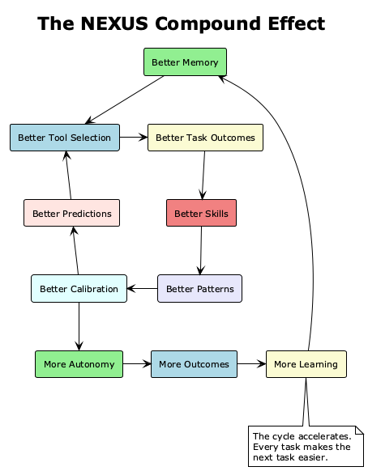

### 6. Platform Advantage

NEXUS is the only coding agent architecturally designed for macOS. It uses FSEvents (not polling) for file watching, Metal (not CUDA) for GPU compute, Keychain (not environment variables) for secrets, and launchd (not Docker) for process management. On Apple Silicon hardware -- which dominates the professional developer market -- NEXUS has an inherent performance advantage that containerized competitors cannot match.

### Summary

NEXUS does not compete on any single axis. It wins because it is the first coding agent architecture where **every cognitive capability reinforces every other**. Memory reinforces planning. Planning reinforces tool use. Tool use reinforces learning. Learning reinforces memory. The system is not a collection of features -- it is a *cognitive flywheel* that accelerates with every revolution.

No existing system -- open-source or commercial -- has proposed this level of cognitive integration for an AI coding agent. NEXUS is not an incremental improvement. It is an architectural paradigm shift.

---

*End of ClaudeDev v0.2.0 AI Brain Architecture: The NEXUS Paradigm*
*Total specification: 12 parts across cognitive layers, memory, decisions, integration, tools, evolution, implementation, structure, models, and competitive analysis.*
